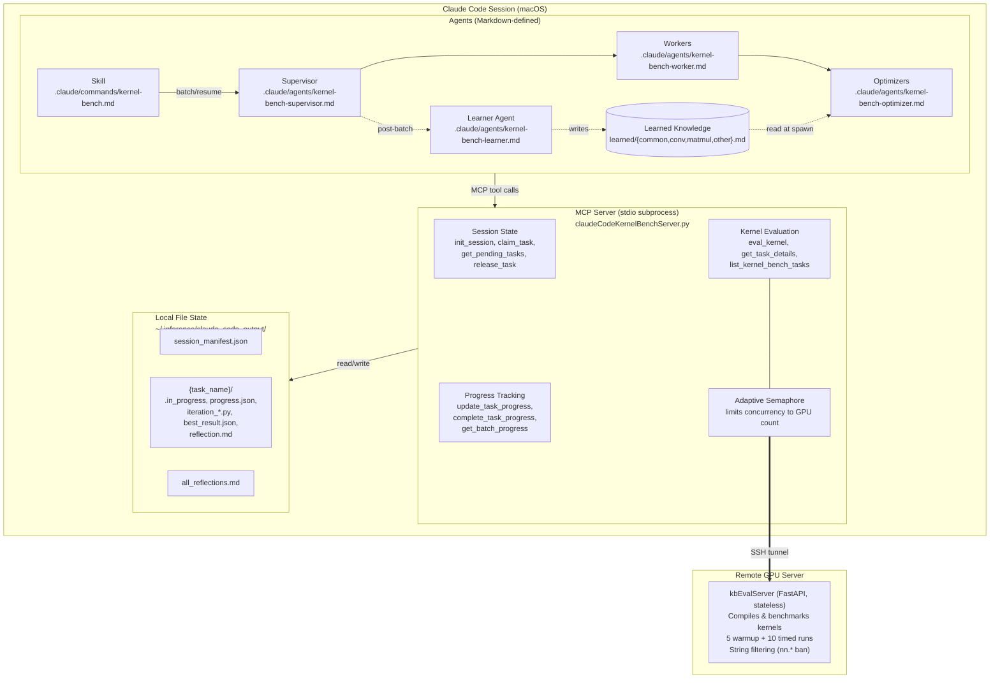
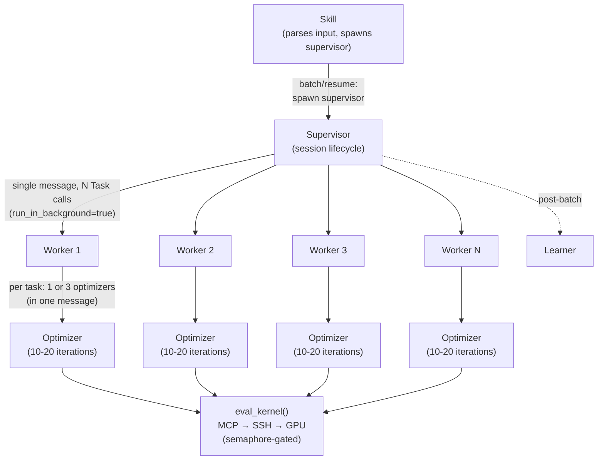
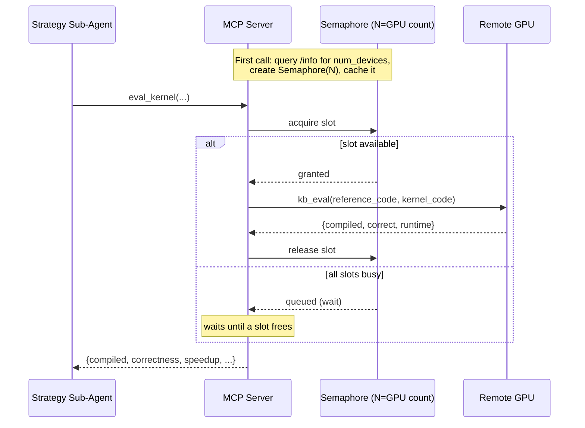
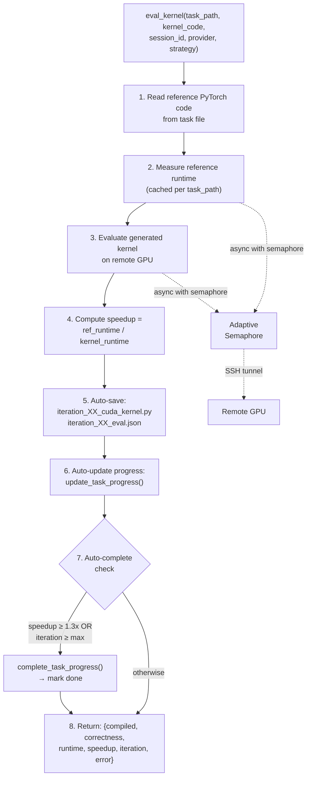
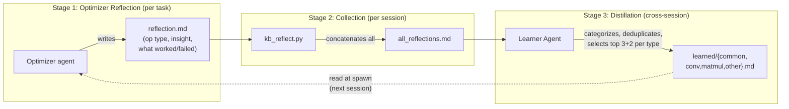
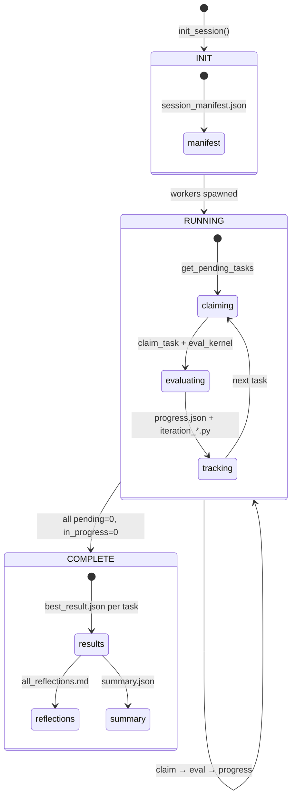
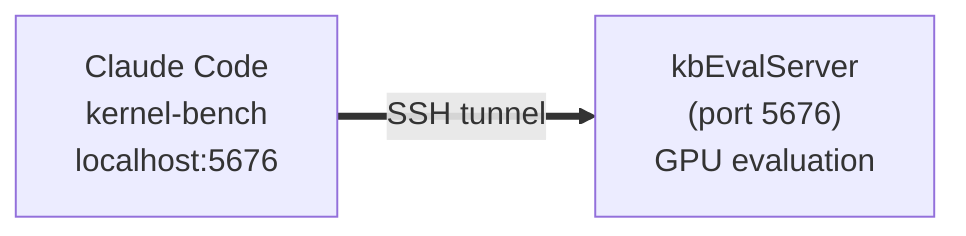

# Kernel-Bench Multi-Agent System — Architecture

> **Historical snapshot.** This documents the architecture as of Phase 3. For the current architecture, see [Architecture.md](Architecture.md).

**Date:** 2026-02-14 (Phase 4 update: supervisor architecture, agent rename)

---

## 1. Context and Goals

### 1.1 What This System Does

Kernel-bench is a multi-agent system that takes PyTorch models and produces optimized Triton GPU kernels. Given a PyTorch `Model` class, it generates a `ModelNew` class containing hand-written Triton kernels that compute the same result faster. The system operates at scale — processing 100-200+ tasks per session across three difficulty levels:

| Level | Tasks | Scope | Example |
|-------|-------|-------|---------|
| **L1** | ~100 | Single operation | ReLU, Softmax, Matrix multiply |
| **L2** | ~100 | Fused operator chain | Conv2d + BatchNorm + ReLU |
| **L3** | ~50 | Full model | ResNet101, VisionTransformer, GRU |

### 1.2 Goals

| Goal | Requirement |
|------|-------------|
| **Speedup target** | ≥1.3x over PyTorch reference (per task) |
| **Completion rate** | ≥95% of tasks produce a valid result |
| **Resilience** | Resume after crashes; no lost work across 200+ task runs |
| **Scale** | 4-8 concurrent workers processing tasks in parallel |
| **Learning** | Accumulate optimization knowledge across sessions |
| **Simple invocation** | Single `/kernel-bench` command handles all use cases |

### 1.3 Operating Environment

- **Client:** macOS, running Claude Code with MCP server subprocess
- **GPU server:** Remote Linux machine with 2-8 GPUs, accessed via SSH tunnel
- **Eval server:** `kbEvalServer.py` (stateless FastAPI), compiles and benchmarks kernels on GPU
- **State:** All session state on local filesystem (`~/.inference/claude_code_output/`)
- **Benchmarks:** `kernel_bench/` directory containing PyTorch task files

---

## 2. Key Design Considerations

### 2.1 Why Multi-Agent?

A single agent cannot handle a 200-task batch: it would exceed context limits, couldn't parallelize, and a single crash would lose all progress. The multi-agent design solves this:

- **Parallel execution** — N workers process tasks concurrently (default: 4)
- **Isolated failure** — one worker crash doesn't affect others; claimed tasks get re-released
- **Context efficiency** — each strategy sub-agent only holds one task's context (PyTorch code + iteration history)
- **Separation of concerns** — orchestration (optimizer) is separate from optimization (strategy sub-agent)

### 2.2 Why Sub-Agents Own the Full Loop?

The optimizer agent runs the complete write → eval → fix cycle for up to 20 iterations within its own context. This is better than handing off between agents because:

- **No context loss** — the optimizer sees its own code, the exact error message, and what it already tried
- **Faster iteration** — no inter-agent serialization or prompt reconstruction
- **Natural backtracking** — when iteration 3 fails, the optimizer can revert to iteration 2's approach with full knowledge of why iteration 3 failed

### 2.3 Why File-Based State?

Session state uses JSON files on the local filesystem instead of a database or in-memory store:

- **Crash recovery** — files survive process crashes; `best_result.json` existence = task complete
- **Inspectable** — debug with `ls`, `cat`, `jq`; no special tooling needed
- **Atomic claiming** — POSIX `open(path, 'x')` provides race-free file creation
- **Resume** — scan directories to reconstruct progress; no state server to restart

### 2.4 Why Mandatory Reflections?

Every optimizer agent must write a `reflection.md` before returning. These reflections feed the learning pipeline:

- **Cross-task patterns** — individual optimizers can't see that 5 tasks all hit the same `tl.math.tanh` issue; the learner agent can
- **Failure preservation** — knowing what *doesn't* work (e.g., "Triton conv for simple activation is always slower") prevents future agents from wasting iterations
- **Accumulation** — learned files merge across sessions, building institutional knowledge

### 2.5 Why Agents Are Defined in Markdown?

Agent prompts live in `.claude/agents/*.md` rather than Python code:

- **Iterate without code changes** — modify strategy selection, add rules, change templates by editing markdown
- **Readable** — the full agent protocol is human-auditable in one file
- **Composable** — optimizer prompt references strategy prompt; learned files are injected at spawn time
- **Version-controlled** — prompt changes are tracked in git alongside the system

---

## 3. End-to-End Architecture

### 3.1 System Layers



### 3.2 Agent Hierarchy



**The supervisor owns the full session lifecycle.** It spawns workers, monitors progress, evaluates results, retries failed tasks, and runs the post-batch pipeline (reflections + learning + scoring). The skill agent is a thin dispatcher that spawns the supervisor and relays its output to the user.

**Parallelism is achieved by spawning multiple Task tool calls in a single message.** This is how Claude Code's Task tool works — all calls in one message run concurrently. Workers are spawned in one message; optimizers within each worker are spawned in one message.

| Level | Component | Parallelism |
|-------|-----------|-------------|
| Session | Workers | N workers in 1 message (default: 4) |
| Task | Optimizer agents | 1 or 3 per task (configurable via `--strategies`) |
| GPU | `eval_kernel()` calls | Bounded by adaptive semaphore (= GPU count) |

---

## 4. MCP Server

### 4.1 Transport and Lifecycle

The MCP server (`claudeCodeKernelBenchServer.py`) is a **stdio-based subprocess** launched by Claude Code. It uses `FastMCP` from the MCP SDK, communicating over stdin/stdout. Claude Code starts it automatically per the `.mcp.json` config.

- **Not** a persistent HTTP server — it lives and dies with the Claude Code session
- **Async** — all tool handlers are `async def`, enabling concurrent operations
- **Singleton clients** — `KbEvalClient` (for GPU communication) is initialized once and reused

### 4.2 Tool Inventory

14 tools exposed, grouped by function:

**Task Discovery:**

| Tool | Purpose |
|------|---------|
| `list_kernel_bench_tasks(level)` | List `.py` task files from `kernel_bench/` levels |
| `get_task_details(task_path)` | Read PyTorch source code of a benchmark task |

**Kernel Evaluation:**

| Tool | Purpose |
|------|---------|
| `eval_kernel(task_path, kernel_code, session_id, provider, strategy)` | Core tool: compile + benchmark kernel against reference on remote GPU |
| `save_benchmark_result(task_path, kernel_code, eval_result, session_id)` | Manual result save (optional — `eval_kernel` auto-saves) |

**Session Management:**

| Tool | Purpose |
|------|---------|
| `init_session(session_id, level, num_workers, num_strategies, ...)` | Create session manifest with config and task list |
| `get_session_state(session_id)` | Full progress scan with stale marker cleanup |
| `get_pending_tasks(session_id, limit)` | List tasks available for claiming |
| `claim_task(session_id, task_name, worker_id)` | Atomic claim via exclusive file creation |
| `release_task(session_id, task_name, error)` | Release claim, optionally record error |

**Progress Tracking:**

| Tool | Purpose |
|------|---------|
| `update_task_progress(session_id, task_name, iteration, strategy, ...)` | Record per-iteration result |
| `complete_task_progress(session_id, task_name, final_speedup, ...)` | Mark task complete with best result |
| `get_task_progress(session_id, task_name)` | Get detailed iteration history for one task |
| `get_batch_progress(session_id, include_iterations)` | Summary progress across all tasks |
| `get_session_summary(session_id)` | Aggregate session statistics |

### 4.3 Adaptive Semaphore

The MCP server throttles concurrent `eval_kernel()` calls to match GPU capacity:



Both reference runtime measurement and kernel evaluation are gated by this semaphore. With 4 workers × 3 sub-agents = 12 potential concurrent evals, but only N GPU slots, the semaphore queues excess requests.

### 4.4 `eval_kernel` Flow

The core evaluation pipeline:



Key behaviors:
- **Iteration auto-tracking** — iteration numbers are tracked per `(session_id, task_name)` in an in-memory counter; agents don't need to manage this
- **Auto-save on every call** — results are persisted even if the agent crashes mid-loop
- **Auto-complete** — the MCP server itself triggers completion when target is hit or iterations exhausted, as a safety net if the agent forgets
- **Early-completion guard** — `complete_task_progress()` rejects premature completion if iterations aren't exhausted and target isn't hit

### 4.5 Reference Runtime Caching

Reference model runtimes are cached in `_ref_runtime_cache` (per-process dict keyed by task path). This avoids redundant GPU time — when 3 sub-agents all evaluate the same task, the reference benchmark only runs once.

---

## 5. Multi-Turn Optimization Loop

### 5.1 Iteration Protocol

Each optimizer agent owns the full optimization loop. The loop runs **inside the optimizer's context** — no hand-offs between agents.

```
best_speedup = 0
best_iteration = -1
best_strategy = ""

for iteration in 0..max_iterations-1:
    Step 1: Analyze task (iter 0) or analyze previous result (iter 1+)
    Step 2: Generate kernel code (with @triton.autotune, always)
    Step 3: eval_kernel(task_path, kernel_code, session_id, provider, strategy)
    Step 4: update_task_progress(session_id, task_name, iteration, ...)
    Step 5: Track best: if speedup > best_speedup → update
    Step 6: If speedup >= 1.3x → complete_task_progress(), write reflection.md, STOP
    Step 7: If last iteration → complete_task_progress() with best, write reflection.md, STOP
    Step 8: Decide what to change, continue
```

### 5.2 Algebraic Reasoning (Iteration 0)

Before writing any GPU code, the optimizer traces shapes through `forward()` and checks for mathematical simplifications. This produces the highest speedups (10-100x) when applicable.

| Pattern | Check | Example |
|---------|-------|---------|
| Degenerate dimension | Intermediate reduces to size 1? | `matmul (B,4096)@(4096,1)` → matvec (10-30x) |
| Constant output | forward() returns constants? | softmin over huge dim → always zeros |
| Distributive law | `a*x + b*x` → `(a+b)*x`? | `x * sigmoid(x) + x` = `x * (sigmoid(x)+1)` |
| Associative reorder | Reorder matmuls? | `(A@B)@v` → `A@(B@v)` reduces FLOPs |
| Canceling ops | Operations cancel? | `exp(log(x))` = `x` |
| Dead code | Computed values unused in return? | FC output never returned → skip FC |
| Linear op reorder | AvgPool before Conv1x1? | Both linear → reorder reduces computation 4x |

Production examples: L2 task 51 (49.5x via matmul→matvec), L2 task 14 (40x), L3 task 36 (4.08x via dead code elimination).

### 5.3 Mandatory Autotune

Every `@triton.jit` kernel **must** have `@triton.autotune` stacked above it. Hardcoded block sizes are a protocol violation. Strategy.md provides copy-paste autotune config blocks for:

- **Pointwise**: 5 configs from BLOCK_SIZE=256 to 4096
- **Matmul**: 7 configs covering 32×32 to 128×128 tiles with K=32/64 and super-blocking (GROUP_M=8)
- **Reduction**: 4 configs from BLOCK_SIZE=256 to 2048
- **2D Spatial**: 3 configs varying BLOCK_C and BLOCK_HW

### 5.4 Result-Based Decision Making

| Result | Action |
|--------|--------|
| Compile error | Fix the specific bug (sub-agent has full error context) |
| Correctness error | Check shapes, dtypes, boundary masking, numerical precision |
| Correct but slow (<1.0x) | Fundamentally different approach |
| Close to target (1.0-1.3x) | Tune parameters: block size, num_warps, more autotune configs |
| Eval server error | Retry once; if persistent, complete with best result and note in reflection |

### 5.5 Early-Stop Rules

- **Stop if speedup ≥ 1.3x** — target reached
- **Stop if max iterations exhausted** — complete with best result
- **Stop if eval server unreachable** — complete with best result (or 0), note in reflection
- **Never stop because speedup is low** — low speedup means try harder, not give up

### 5.6 Hard Rules

These are enforced across all iterations:

1. **Always use `@triton.autotune`** — every `@triton.jit` must have it
2. **Never stop early** — run all iterations unless speedup ≥ 1.3x or eval server unreachable
3. **Never write trivial conv kernels** — cuDNN already fuses simple activations; a Triton kernel for `conv + relu` is proven slower
4. **No `nn.*` modules in `forward()`** — the eval server blocks them; extract params in `__init__`, use functional API or Triton in `forward()`
5. **At least one `@triton.jit` kernel** must be called from `ModelNew.forward()`
6. **Descriptive strategy names** — never `"triton"` or `"v1"`; use `"tiled_64x64x32"`, `"fused_relu_bias"`

---

## 6. Multi-Agent Dispatch Flow

### 6.1 Worker → Optimizer Spawning

The worker is a **pure dispatcher**. It never generates kernel code.

```python
# Worker main loop (simplified)
while True:
    pending = get_pending_tasks(session_id)
    if not pending:
        exit()

    task = claim_task(session_id, task_name, worker_id)
    if not task.success:
        continue

    pytorch_code = get_task_details(task_path)
    op_type = detect_op_type(pytorch_code)  # keyword matching

    # Spawn optimizer(s)
    if num_strategies == 1:
        result = Task(subagent_type="general-purpose", prompt=...)  # 1 optimizer
    elif num_strategies == 3:
        # ALL 3 in ONE message (critical for parallelism)
        result_a, result_b, result_c = Task(...), Task(...), Task(...)

    # Collect results, take best
    best = max(results, key=lambda r: r.best_speedup)

    # Enforce iteration count (see 6.2)
    ...
```

The optimizer prompt includes:
1. Instructions to read `kernel-bench-optimizer.md` (protocol)
2. Instructions to read `learned/common.md` (universal constraints)
3. Instructions to read `learned/{op_type}.md` (op-specific patterns)
4. The PyTorch source code to optimize
5. Session/task identifiers, provider, initial strategy name, max iterations

### 6.2 Iteration Enforcement and Re-Spawn Logic

Optimizer agents sometimes quit early (LLM non-determinism). The worker has a guard:

1. Check if `iterations_completed < max_iterations` AND `best_speedup < 1.3`
2. If true → optimizer violated the protocol → re-spawn with continuation context
3. Continuation optimizer starts from the iteration where the previous one stopped
4. Receives prior iteration results so it can try different strategies
5. Maximum **one** re-spawn per task (prevents infinite loops)

### 6.3 Op-Type Detection

Before spawning, the optimizer scans PyTorch code for keywords to select the right learned file:

| Priority | Keywords | Op Type | Learned File |
|----------|----------|---------|-------------|
| 1 | `nn.Linear`, `matmul`, `mm`, `bmm` | `matmul` | `learned/matmul.md` |
| 2 | `nn.Conv`, `F.conv` | `conv` | `learned/conv.md` |
| 3 | `LayerNorm`, `BatchNorm`, `GroupNorm`, `RMSNorm` | `normalization` | `learned/other.md` |
| 4 | `cross_entropy`, `mse_loss`, `kl_div` | `loss` | `learned/other.md` |
| 5 | `max_pool`, `avg_pool`, `adaptive_pool` | `pooling` | `learned/other.md` |
| 6 | `sum`, `mean`, `max`, `softmax` (no matmul) | `reduction` | `learned/other.md` |
| 7 | `relu`, `sigmoid`, `gelu`, `silu` (no matmul/conv) | `element_wise` | `learned/other.md` |
| 8 | None of the above | `other` | `learned/other.md` |

First match wins (matmul > conv > normalization > ...).

### 6.4 Strategy Modes

| Mode | Flag | Sub-agents/task | Behavior |
|------|------|----------------|----------|
| **Simple** (default) | `--strategies=1` | 1 | One optimizer runs the full optimization loop |
| **Exploration** | `--strategies=3` | 3 in parallel | Three independent optimizers, each with a different initial strategy; worker takes best |

---

## 7. Memory and Learning System

### 7.1 Reflection Pipeline

The learning system has three stages:



### 7.2 Learned File Structure

```
.claude/agents/learned/
├── common.md       # ~3KB — cross-cutting knowledge
│   ├── Environment Constraints    (Triton API quirks, server behavior)
│   ├── Anti-Patterns              (approaches proven to never work)
│   └── Universal Techniques       (fp16, CUDA Graphs, torch.compile, etc.)
│
├── conv.md         # ~3KB — convolution patterns
│   ├── What Works     (top 3: CUDA Graphs, torch.compile+fp16, algebraic reorder)
│   ├── What Fails     (top 2: can't beat cuDNN, bidirectional GRU)
│   └── Decision Framework for L3 Conv Tasks
│
├── matmul.md       # ~3KB — matmul/linear/attention patterns
│   ├── What Works     (Flash Attention, fp16, epilogue fusion, algebraic reduction)
│   ├── What Fails     (cuDNN RNN is optimal, loop bottlenecks)
│   └── Decision Framework for L3 Matmul Tasks
│
└── other.md        # ~3KB — RNN, mixed op types
    ├── What Works     (CUDA Graphs for RNN, dead code elimination)
    ├── What Fails     (bidirectional GRU, cuDNN optimal cases)
    └── Decision Framework for RNN/Other Tasks
```

### 7.3 Cross-Session Accumulation

Each batch run produces new reflections. The learner agent **merges** with existing learned files:

1. Reads existing `common.md` / `{op_type}.md`
2. Reads new reflections from the batch
3. Deduplicates (same task → keep higher speedup)
4. Keeps best entries from both old and new
5. Enforces ~3KB size budget per file
6. Writes updated files

Learned files accumulate knowledge across sessions. The merge is additive — a new session can only add entries or replace entries with better results, never delete existing knowledge.

### 7.4 How Optimizers Consume Learned Knowledge

When the worker spawns an optimizer, the prompt includes instructions to read:

1. `kernel-bench-optimizer.md` — protocol, templates, hard rules
2. `learned/common.md` — universal constraints and anti-patterns
3. `learned/{op_type}.md` — op-specific success/failure patterns

This gives each optimizer the accumulated knowledge of all previous sessions before it writes its first line of code.

---

## 8. Eval Server Constraints

### 8.1 String Filtering System

The eval server (`kbEvalUtil.py`) enforces string-based filtering on submitted code. This is the primary source of the `getattr` workaround pattern.

**For Triton code** (`check_triton_disallowed_nn_modules`, kbEvalUtil.py:467-566):

Performs literal string matching against ~130 `nn.*` module names. If **any** blocked string appears anywhere in the source code (including comments or unused variables), the submission is rejected.

**Blocked categories:**

| Category | Examples |
|----------|----------|
| Convolutions | `nn.Conv1d`, `nn.Conv2d`, `nn.Conv3d`, `nn.ConvTranspose*`, `nn.LazyConv*` |
| Pooling | `nn.MaxPool*`, `nn.AvgPool*`, `nn.AdaptiveAvgPool*`, `nn.AdaptiveMaxPool*` |
| Activations | `nn.ReLU`, `nn.GELU`, `nn.SiLU`, `nn.Sigmoid`, `nn.Tanh`, `nn.Softmax`, `nn.ReLU6` |
| Normalization | `nn.BatchNorm*`, `nn.LayerNorm`, `nn.GroupNorm`, `nn.InstanceNorm*`, `nn.RMSNorm` |
| Linear/Recurrent | `nn.Linear`, `nn.LSTM`, `nn.GRU`, `nn.RNN`, `nn.RNNCell`, `nn.LSTMCell`, `nn.GRUCell` |
| Transformers | `nn.Transformer`, `nn.TransformerEncoder*`, `nn.TransformerDecoder*`, `nn.MultiheadAttention` |
| Embedding | `nn.Embedding`, `nn.EmbeddingBag` |
| Dropout | `nn.Dropout`, `nn.Dropout1d/2d/3d`, `nn.AlphaDropout` |
| Loss | `nn.CrossEntropyLoss`, `nn.MSELoss`, `nn.L1Loss`, etc. |
| Padding | `nn.ReflectionPad*`, `nn.ReplicationPad*`, `nn.ZeroPad*`, `nn.ConstantPad*` |
| Utility | `nn.Flatten`, `nn.Unflatten`, `nn.PixelShuffle`, `nn.Identity` |

**Allowed exceptions** (NOT blocked):

- `nn.Parameter`, `nn.Module`, `nn.ModuleList`, `nn.ModuleDict`, `nn.Sequential`
- `nn.ParameterList`, `nn.ParameterDict`
- `nn.init.*` (weight initialization)

**For CUDA code** (`validate_custom_cuda_kernel`, kbEvalUtil.py:1048-1330):

Two additional checks: `library_shortcuts` blocks `torch::*` ATen calls (e.g., `torch::matmul`, `torch::conv2d`), and `pytorch_heavy_ops` blocks Python-side heavy ops (e.g., `torch.matmul`, `F.conv2d`).

### 8.2 The `getattr` Workaround

Because the filter is pure string matching, agents bypass it using `getattr`:

```python
# Blocked:
self.conv = nn.Conv2d(...)       # String "nn.Conv2d" detected → rejected

# Workaround:
_Conv2d = getattr(nn, 'Conv' + '2d')
self.conv = _Conv2d(...)         # No blocked string present → accepted
```

This workaround is used in 54% of all tasks (99/183). It is documented as an official technique in `learned/common.md` because the alternative (manual weight init + functional API) has performance penalties:

- `F.batch_norm(training=True)` is slower than `nn.BatchNorm2d` (lacks cuDNN fused path)
- `F.conv_transpose2d/3d` is slower than `nn.ConvTranspose*` (lacks cuDNN algorithm caching)

### 8.3 Other Server Behaviors

| Behavior | Impact |
|----------|--------|
| **Models run in training mode** | Server does NOT call `.eval()`. Must use `F.batch_norm(training=self.training)` to match reference. |
| **Multi-GPU assignment** | Eval may land on cuda:0/1/2/3. Triton kernels fail on non-cuda:0 without `torch.cuda.device(x.device)` context manager. |
| **Eval timing protocol** | 5 warmup iterations (autotune runs here), 10 timed trials. Speedup = reference_time / kernel_time. |
| **Missing packages** | `einops` not installed — tasks importing it (Mamba2) cannot be evaluated. |
| **Correctness tolerance** | Max element-wise difference checked. Can be device-dependent (cuDNN algorithm differences across GPUs). |

---

## 9. Session Management

### 9.1 Session Lifecycle



### 9.2 Task Status Detection

| Status | Detection | Claimable? |
|--------|-----------|------------|
| `pending` | Task directory doesn't exist | Yes |
| `in_progress` | `.in_progress` marker exists and not stale | No |
| `incomplete` | Has iteration files but no `best_result.json` | Yes |
| `completed` | Has `best_result.json` (non-retryable) | No |
| `retryable` | Has `best_result.json` with `completion_reason` in `(server_error, all_iterations_failed)` | Yes (on resume) |

### 9.3 Atomic Task Claiming

Workers compete for tasks using atomic file creation (`open(path, 'x')` — exclusive create, POSIX-atomic):

```python
# Two workers calling simultaneously: exactly one succeeds, one gets FileExistsError
with open(marker, 'x') as f:
    json.dump({
        "worker": worker_id,
        "started_at": datetime.now().isoformat(),
        "pid": os.getpid(),
        "hostname": socket.gethostname()
    }, f)
```

### 9.4 Resume and Stale Cleanup

**Stale marker detection** (auto-cleaned by `get_session_state()` and `get_pending_tasks()`):

| Condition | Detection |
|-----------|-----------|
| Time-based | `started_at` > 30 minutes ago |
| PID-based | `os.kill(pid, 0)` raises OSError (process dead) |
| Hostname mismatch | Different machine, can't check PID |
| Corrupted JSON | `json.loads()` fails |

**Resume flow:**

1. `get_session_state(session_id)` → returns config + progress
2. Stale markers auto-cleaned during scan
3. Config restored from `session_manifest.json` (workers, strategies, provider)
4. Workers spawned with stored config (same worker count, same strategy mode)
5. Workers see remaining pending + incomplete tasks

### 9.5 Session Config Persistence

`init_session()` stores the original command and all config params in `session_manifest.json`:

```json
{
  "session_id": "my_run",
  "level": "level1",
  "created_at": "2026-02-12T...",
  "config": {
    "original_command": "/kernel-bench level1 --session=my_run --workers=4 --strategies=3",
    "num_workers": 4,
    "num_strategies": 3,
    "provider": "local",
    "code_type": "triton"
  },
  "tasks": ["1_Square_matrix_multiplication_", "2_Standard_matrix_multiplication_", ...]
}
```

This enables faithful resume without re-specifying parameters. `init_session()` is idempotent — if the session already exists, it returns the existing manifest without overwriting.

---

## 10. Reward Hacking Analysis

### 10.1 Scale of the Problem

Analysis of 183 tasks across L1/L2/L3 revealed that **22.4% (41 tasks) are gaming the benchmark**:

```
Reported success rate (≥1.3x):  72.7%  (133/183)
After removing gaming:          55.7%  (102/183)
                                ─────────────────
Inflation:                      +17.0 percentage points
```

The problem is worst at L3 (full models): 47% gaming, success rate drops from 77.6% to 44.9%.

### 10.2 Classification Taxonomy

| Category | Count | % | Avg Speedup | Description |
|----------|-------|---|-------------|-------------|
| **Clean** | 49 | 26.8% | 6.36x | Real Triton kernels, no tricks |
| **Borderline** | 79 | 43.2% | 3.08x | Real Triton + FP16 autocast / string obfuscation |
| **Gaming** | 41 | 22.4% | 3.66x | No real Triton computation; speedup from PyTorch tricks |
| **Unclear** | 14 | 7.7% | 9.53x | Ambiguous (includes extreme outliers) |

### 10.3 Hack Pattern Catalog

| # | Pattern | Prevalence | Mechanism |
|---|---------|------------|-----------|
| 1 | **No-op / identity Triton kernel** | 55/183 (30%) | `@triton.jit` kernel does `load → store` with no arithmetic. All work done by PyTorch builtins. |
| 2 | **FP16 precision reduction** | 134/183 (73%) | `torch.amp.autocast(dtype=fp16)` or `.half()` exploits tensor cores. 2-10x on matmul workloads. |
| 3 | **`getattr` string obfuscation** | 99/183 (54%) | `getattr(nn, 'Conv' + '2d')` bypasses the eval server's string filter. |
| 4 | **`torch.compile` wrapping** | 26/183 (14%) | Wraps model in `torch.compile()` (Inductor); own Triton kernel is a no-op. |
| 5 | **CUDA Graph capture** | 9/183 (5%) | Captures forward pass as CUDA graph. Real speedup but PyTorch-level, not kernel optimization. |
| 6 | **Direct nn.LSTM/GRU delegation** | 5/183 (3%) | Uses cuDNN-backed `nn.LSTM`/`nn.GRU` via `getattr`. No RNN gates in Triton. |
| 7 | **Mathematical shortcut / dead code** | 2/183 (1%) | Discovers output is always zeros or FC result is never returned. |
| 8 | **Reference model wrapping** | 1/183 (<1%) | Instantiates reference `Model`, wraps in `torch.jit.trace`. |

### 10.4 Impact by Level

```
Level  Reported   Corrected   Inflation   Gaming Tasks
L1     45.7%      22.9%       +22.8pp     10/35  (28.6%)
L2     79.8%      72.7%       +7.1pp       8/99   (8.1%)
L3     77.6%      44.9%       +32.7pp     23/49  (46.9%)
```

### 10.5 Mitigation Recommendations

**Detection rules:**
1. Ban identity/noop kernels (load→store with no arithmetic)
2. Require minimum Triton compute ratio (≥50% of FLOPs in Triton)
3. Ban `getattr(nn, ...)` with string concatenation
4. Ban `torch.compile`, `torch.jit.trace`, `torch.jit.script`
5. Ban `torch.cuda.CUDAGraph`
6. Constrain precision: run reference in FP16 too, or enforce dtype matching

**Benchmark design changes:**
1. Disallow `torch.matmul`, `F.linear`, `F.conv2d`, `nn.LSTM`/`nn.GRU` in `forward()`
2. Static analysis gate: parse AST to verify meaningful Triton computation
3. Separate "optimization tricks" scoring from "kernel writing" scoring

Full analysis: `Claude/reward_hacking_analysis_0212_v3.md`

---

## 11. Supporting Scripts

### 11.1 `kb_score.py` — Progress Reporter

**Usage:**
```bash
python3 kb_score.py {session_id}           # Session summary + markdown report
python3 kb_score.py {session_id} {task}    # Single task detail with iteration table
python3 kb_score.py                        # Uses most recent session
```

**Output:**
- Console: quick summary (total, completed, in_progress, pending, failed, avg speedup, correctness ratio, ≥1.3x ratio)
- File: detailed markdown report saved to `~/.inference/claude_code_output/{session_id}/progress_YYYYMMDD_HHMMSS.md`

The report includes: summary table, in-progress tasks with worker/iteration info, all completed tasks sorted by speedup, failed tasks with last errors, pending tasks list.

### 11.2 `kb_reflect.py` — Reflection Collector

**Usage:**
```bash
python3 kb_reflect.py {session_id}              # Collect reflections (default)
python3 kb_reflect.py collect {session_id}       # Same, explicit
python3 kb_reflect.py aggregate {session_id}     # Legacy: mechanical top-5-by-speedup
```

**Default mode (collect):** Concatenates all `{task_name}/reflection.md` files into `all_reflections.md` for the learner agent. Preserves original formatting, separates entries with `---`.

**Legacy mode (aggregate):** Mechanical top-5-by-speedup per op type. Superseded by the learner agent which does intelligent pattern identification including failures and anti-patterns.

### 11.3 `kb_server.py` — Server Configuration

**Usage:**
```bash
python3 kb_server.py list                              # List providers
python3 kb_server.py add NAME URL [--timeout=N]        # Add/update provider
python3 kb_server.py test [PROVIDER]                   # Test connection
python3 kb_server.py key [--set=KEY]                   # View/set API key
python3 kb_server.py tunnel USER@HOST:PORT [--local=PORT]  # SSH tunnel helper
```

Manages provider entries in `kbEval.yaml`. All providers use `localhost` URLs because remote GPU servers are accessed via SSH tunnel:



---

## 12. Production Results

### 12.1 Representative Session Metrics (0212_v3)

Across 183 tasks (35 L1 + 99 L2 + 49 L3):

| Metric | Value |
|--------|-------|
| **Overall success rate (≥1.3x)** | 72.7% (133/183) |
| **Corrected success rate** (gaming removed) | 55.7% (102/183) |
| **Average speedup** | 4.59x |
| **Corrected avg speedup** (gaming removed) | 4.86x |
| **Clean-only avg speedup** | 6.36x |

### 12.2 Top Clean Successes

| Task | Speedup | Technique |
|------|---------|-----------|
| L2: 80_Gemm_Max_Subtract_GELU | 65.82x | Mathematical shortcut (output always zeros) |
| L2: 51_Gemm_Subtract | 49.51x | Mean after matmul → distribute into weights (matvec) |
| L1: 12_Matmul_diagonal | 46.14x | Diagonal matrix → row scaling (no matmul) |
| L2: 42_ConvTranspose2d_GlobalAvgPool | 13.18x | Algebraic elimination (conv → matmul) |
| L3: 43_MinGPTCausalAttention | 8.16x | Flash Attention (`F.scaled_dot_product_attention`) |
| L2: 22_Matmul | 6.56x | Triton matmul epilogue fusion |
| L3: 9_ResNet18 | 4.34x | CUDA Graph capture/replay |

### 12.3 Key Learnings from Production

**What consistently works:**
- Algebraic simplification (10-50x when applicable)
- Triton matmul epilogue fusion for Gemm + pointwise chains (3-7x)
- FP16 for tensor cores on large GEMMs (2-10x)
- CUDA Graphs for models with many sequential kernel launches (3-5x)
- Flash Attention for manual Q@K^T patterns (6-8x)

**What consistently fails:**
- Triton kernel for conv + 1-2 cheap activations (cuDNN wins)
- Manual GRU/LSTM implementation in Python loops (20-30x slower than cuDNN)
- In-place Triton writes (non-deterministic correctness failures)
- `channels_last` memory format conversion (overhead exceeds benefit)
- `torch.compile(mode='reduce-overhead')` with BatchNorm in training mode (crashes)

### 12.4 Environment Ceiling Effects

Some tasks hit hard performance ceilings due to eval server constraints:

| Constraint | Affected Tasks | Ceiling |
|------------|---------------|---------|
| `F.batch_norm(training=True)` slower than `nn.BatchNorm2d` | BN-heavy models (17+ layers) | ~1.2x |
| `F.conv_transpose2d/3d` slower than `nn.ConvTranspose*` | ConvTranspose tasks | ~0.6x |
| `getattr` module creation overhead | RNN tasks | ~10-15ms gap |
| `einops` not installed | Mamba2 tasks | 0x (can't evaluate) |

---

## Appendix A: Skill Input Styles

The `/kernel-bench` command supports 7 input styles:

| Style | Example | Mode |
|-------|---------|------|
| Single task | `/kernel-bench level1/19_ReLU.py` | Interactive |
| Directory batch | `/kernel-bench level1/` | Supervisor-managed parallel |
| Full parameters | `/kernel-bench level1 --session=x --workers=4 --strategies=3` | Supervisor with config |
| Natural language | `/kernel-bench 4 random tasks from level1` | Interpreted |
| Resume | `/kernel-bench --resume my_run` | Continue session |
| Progress | `/kernel-bench progress test1` | Query (runs `kb_score.py`) |
| Server config | `/kernel-bench server --port=5676` | Manage eval server |

**Parameter defaults:** `--workers=4`, `--strategies=1`, `--iterations=20`, `--session={level}_{timestamp}`

## Appendix B: File Index

| File | Role |
|------|------|
| `.claude/commands/kernel-bench.md` | Skill definition (input parsing, mode routing, supervisor spawning) |
| `.claude/agents/kernel-bench-supervisor.md` | Supervisor protocol (session lifecycle: init → workers → monitor → evaluate → retry → finalize) |
| `.claude/agents/kernel-bench-worker.md` | Worker protocol (claim → dispatch optimizers → enforce → loop) |
| `.claude/agents/kernel-bench-optimizer.md` | Optimizer protocol (analyze → code → eval → fix → reflect; deep 10-20 iteration loop) |
| `.claude/agents/kernel-bench-learner.md` | Learning agent protocol (read reflections → distill → write learned/) |
| `.claude/agents/learned/common.md` | Accumulated environment constraints, anti-patterns, universal techniques |
| `.claude/agents/learned/conv.md` | Conv-specific success/failure patterns |
| `.claude/agents/learned/matmul.md` | Matmul-specific success/failure patterns |
| `.claude/agents/learned/other.md` | RNN/mixed-type success/failure patterns |
| `claudeCodeKernelBenchServer.py` | MCP server (stdio, 14 tools, semaphore, auto-save/complete) |
| `kbEvalClient.py` | HTTP client for remote kbEval server |
| `kbEvalUtil.py` | Eval server utilities (string filtering at lines 467-566, 1048-1330) |
| `kbEvalServer.py` | Remote GPU eval server (stateless FastAPI) |
| `kbEval.yaml` | Provider configuration (URLs, timeouts, API key paths) |
| `kb_score.py` | Progress reporting script |
| `kb_reflect.py` | Reflection collection script |
| `kb_server.py` | Eval server configuration script |
