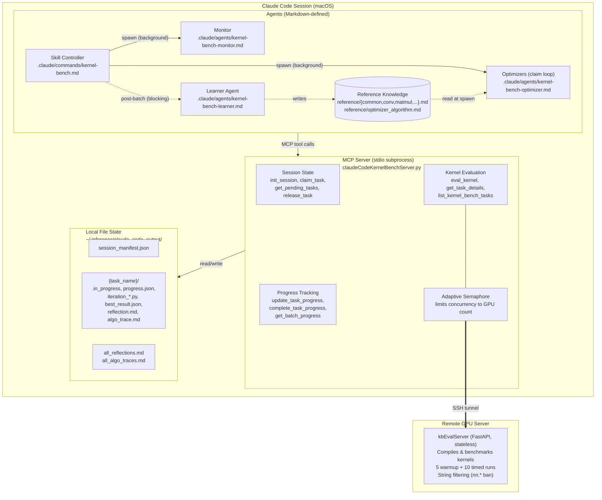
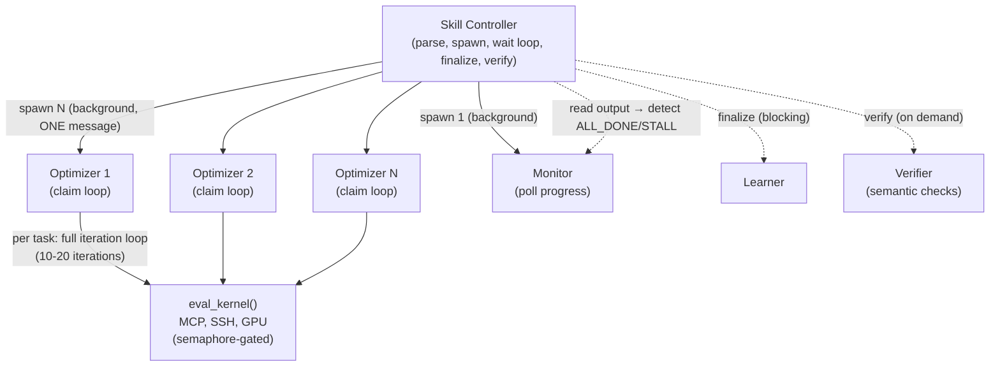
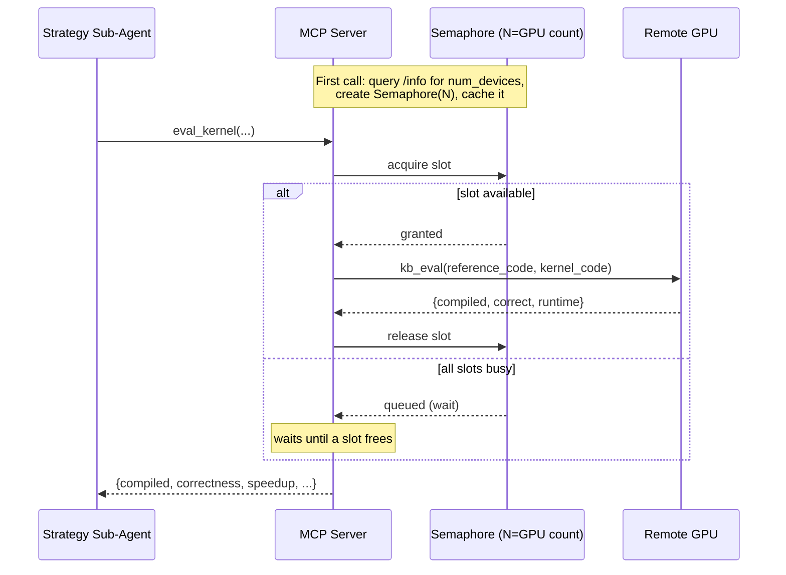
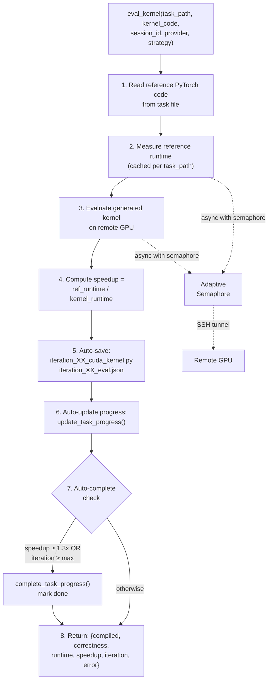
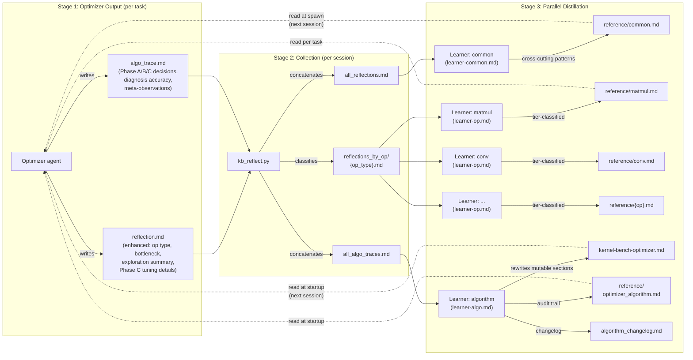
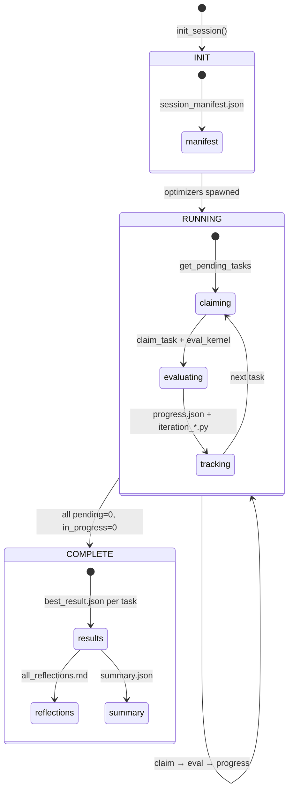
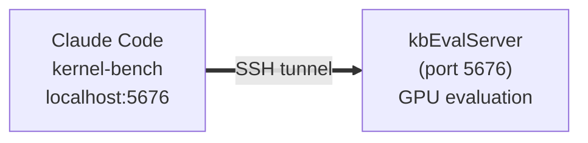

# Kernel-Bench Multi-Agent System — Architecture

> **Living document.** This is the authoritative, always-current reference for the kernel-bench multi-agent system. Update this file whenever the architecture changes.

**Last updated:** 2026-02-15
**Current phase:** Phase 9 (iterative algorithm learning — mutable optimizer sections, parallel learner agents, LEARN mode)

---

## 1. Context and Goals

### 1.1 What This System Does

Kernel-bench is a multi-agent system that takes PyTorch models and produces optimized Triton GPU kernels. Given a PyTorch `Model` class, it generates a `ModelNew` class containing hand-written Triton kernels that compute the same result faster. The system operates at scale — processing 100-200+ tasks per session across three difficulty levels:

| Level | Tasks | Scope | Example |
|-------|-------|-------|---------|
| **L1** | ~100 | Single operation | ReLU, Softmax, Matrix multiply |
| **L2** | ~100 | Fused operator chain | Conv2d + BatchNorm + ReLU |
| **L3** | ~50 | Full model | ResNet101, VisionTransformer, GRU |

### 1.2 Goals

| Goal | Requirement |
|------|-------------|
| **Speedup target** | ≥1.3x over PyTorch reference (per task) |
| **Completion rate** | ≥95% of tasks produce a valid result |
| **Resilience** | Resume after crashes; no lost work across 200+ task runs |
| **Scale** | 4-8 concurrent optimizers processing tasks in parallel |
| **Learning** | Accumulate optimization knowledge across sessions |
| **Simple invocation** | Single `/kernel-bench` command handles all use cases |

### 1.3 Operating Environment

- **Client:** macOS, running Claude Code with MCP server subprocess
- **GPU server:** Remote Linux machine with 2-8 GPUs, accessed via SSH tunnel
- **Eval server:** `kbEvalServer.py` (stateless FastAPI), compiles and benchmarks kernels on GPU
- **State:** All session state on local filesystem (`~/.inference/claude_code_output/`)
- **Benchmarks:** `kernel_bench/` directory containing PyTorch task files

---

## 2. Key Design Considerations

### 2.1 Why Multi-Agent?

A single agent cannot handle a 200-task batch: it would exceed context limits, couldn't parallelize, and a single crash would lose all progress. The multi-agent design solves this:

- **Parallel execution** — N optimizers process tasks concurrently (default: 4)
- **Isolated failure** — one optimizer crash doesn't affect others; claimed tasks get re-released
- **Context efficiency** — each optimizer holds task context for its current optimization loop
- **Flat spawning** — skill controller spawns all agents directly (no intermediate supervisor/worker layers)

### 2.2 Why Sub-Agents Own the Full Loop?

The optimizer agent runs the complete write → eval → fix cycle for up to 20 iterations within its own context. This is better than handing off between agents because:

- **No context loss** — the optimizer sees its own code, the exact error message, and what it already tried
- **Faster iteration** — no inter-agent serialization or prompt reconstruction
- **Natural backtracking** — when iteration 3 fails, the optimizer can revert to iteration 2's approach with full knowledge of why iteration 3 failed

### 2.3 Why File-Based State?

Session state uses JSON files on the local filesystem instead of a database or in-memory store:

- **Crash recovery** — files survive process crashes; `best_result.json` existence = task complete
- **Inspectable** — debug with `ls`, `cat`, `jq`; no special tooling needed
- **Atomic claiming** — POSIX `open(path, 'x')` provides race-free file creation
- **Resume** — scan directories to reconstruct progress; no state server to restart

### 2.4 Why Mandatory Reflections and Traces?

Every optimizer agent must write a `reflection.md` (kernel knowledge) and an `algo_trace.md` (process knowledge) before returning. These feed two separate learning pipelines:

**Kernel knowledge** (from reflections):
- **Cross-task patterns** — individual optimizers can't see that 5 tasks all hit the same `tl.math.tanh` issue; the learner agent can
- **Failure preservation** — knowing what *doesn't* work (e.g., "Triton conv for simple activation is always slower") prevents future agents from wasting iterations
- **Composite patterns** — multi-op optimization strategies that generalize across tasks

**Process knowledge** (from algo traces):
- **Diagnosis calibration** — learning when bottleneck diagnosis is wrong helps future optimizers make better decisions
- **Explore budget tuning** — knowing how many strategies to try by task type reduces wasted iterations
- **Feasibility corrections** — identifying where the feasibility guide is inaccurate prevents both over-investment in infeasible tasks and under-investment in feasible ones

Both streams accumulate across sessions. The merge is additive — each session can only add entries or upgrade existing ones, building institutional knowledge over time.

### 2.5 Why Agents Are Defined in Markdown?

Agent prompts live in `.claude/agents/*.md` rather than Python code:

- **Iterate without code changes** — modify strategy selection, add rules, change templates by editing markdown
- **Readable** — the full agent protocol is human-auditable in one file
- **Composable** — optimizer prompt references strategy prompt; learned files are injected at spawn time
- **Version-controlled** — prompt changes are tracked in git alongside the system

---

## 3. End-to-End Architecture

### 3.1 System Layers



### 3.2 Agent Hierarchy



**The skill controller spawns all agents directly (flat spawning).** There are no intermediate supervisor or worker layers. The skill:

1. **Spawn** — In ONE message, spawn N optimizer agents (each runs a claim loop) + 1 monitor agent (polls progress).
2. **Wait** — Read the monitor's output file periodically. The monitor prints `[progress]` lines and exits with `[monitor] ALL_DONE` or `[monitor] STALL`.
3. **Recover** — If the monitor reports LOW_ACTIVE (optimizers exited while tasks remain) or STALL (zero progress), spawn replacement optimizers + a new monitor. Recovery continues as long as each round makes forward progress, up to 5 rounds. Stops immediately if a round makes zero progress (true stall).
4. **Finalize** — After all tasks complete: collect reflections, spawn learner (blocking), generate score report.
5. **Verify** — Check that all post-batch artifacts exist; run any missing steps directly.

**Parallelism is achieved by spawning multiple Task tool calls in a single message.** Each optimizer runs a claim loop, processing tasks sequentially but independently from other optimizers.

| Level | Component | Parallelism |
|-------|-----------|-------------|
| Session | Optimizers | N optimizers in 1 message (default: 4) |
| Task | Iteration loop | Sequential within each optimizer |
| GPU | `eval_kernel()` calls | Bounded by adaptive semaphore (= GPU count) |

---

## 4. MCP Server

### 4.1 Transport and Lifecycle

The MCP server (`claudeCodeKernelBenchServer.py`) is a **stdio-based subprocess** launched by Claude Code. It uses `FastMCP` from the MCP SDK, communicating over stdin/stdout. Claude Code starts it automatically per the `.mcp.json` config.

- **Not** a persistent HTTP server — it lives and dies with the Claude Code session
- **Async** — all tool handlers are `async def`, enabling concurrent operations
- **Singleton clients** — `KbEvalClient` (for GPU communication) is initialized once and reused

### 4.2 Tool Inventory

14 tools exposed, grouped by function:

**Task Discovery:**

| Tool | Purpose |
|------|---------|
| `list_kernel_bench_tasks(level)` | List `.py` task files from `kernel_bench/` levels |
| `get_task_details(task_path)` | Read PyTorch source code of a benchmark task |

**Kernel Evaluation:**

| Tool | Purpose |
|------|---------|
| `eval_kernel(task_path, kernel_code, session_id, provider, strategy)` | Core tool: compile + benchmark kernel against reference on remote GPU |
| `save_benchmark_result(task_path, kernel_code, eval_result, session_id)` | Manual result save (optional — `eval_kernel` auto-saves) |

**Session Management:**

| Tool | Purpose |
|------|---------|
| `init_session(session_id, level, num_workers, ...)` | Create session manifest with config and task list |
| `get_session_state(session_id)` | Full progress scan with stale marker cleanup |
| `get_pending_tasks(session_id, limit)` | List tasks available for claiming |
| `claim_task(session_id, task_name, worker_id)` | Atomic claim via exclusive file creation |
| `release_task(session_id, task_name, error)` | Release claim, optionally record error |

**Progress Tracking:**

| Tool | Purpose |
|------|---------|
| `update_task_progress(session_id, task_name, iteration, strategy, ...)` | Record per-iteration result |
| `complete_task_progress(session_id, task_name, final_speedup, ...)` | Mark task complete with best result |
| `get_task_progress(session_id, task_name)` | Get detailed iteration history for one task |
| `get_batch_progress(session_id, include_iterations)` | Summary progress across all tasks |
| `get_session_summary(session_id)` | Aggregate session statistics |

### 4.3 Adaptive Semaphore

The MCP server throttles concurrent `eval_kernel()` calls to match GPU capacity:



Both reference runtime measurement and kernel evaluation are gated by this semaphore. With 4 optimizers concurrently evaluating, but only N GPU slots, the semaphore queues excess requests.

### 4.4 `eval_kernel` Flow

The core evaluation pipeline:



Key behaviors:
- **Iteration auto-tracking** — iteration numbers are tracked per `(session_id, task_name)` in an in-memory counter; agents don't need to manage this
- **Auto-save on every call** — results are persisted even if the agent crashes mid-loop
- **Auto-complete** — the MCP server itself triggers completion when target is hit or iterations exhausted, as a safety net if the agent forgets
- **Early-completion guard** — `complete_task_progress()` rejects premature completion if iterations aren't exhausted and target isn't hit

### 4.5 Reference Runtime Caching

Reference model runtimes are cached in `_ref_runtime_cache` (per-process dict keyed by task path). This avoids redundant GPU time — when 3 optimizers all evaluate the same task, the reference benchmark only runs once.

---

## 5. Optimization Algorithm

The three-phase protocol is the core algorithm that each optimizer agent executes per task. It structures kernel optimization as a search problem with two distinct stages: **exploration** (Phase B — breadth-first across fundamentally different strategies) and **exploitation** (Phase C — depth-first tuning of the most promising approach). Phase A precedes both with static analysis that narrows the search space before any GPU evaluation.

This separation is critical because exploring the wrong strategy deeply wastes iterations, while never going deep enough misses the tuning gains that push 1.1x results over the 1.3x target. The explore-then-exploit pattern maps directly to the 4-tier strategy taxonomy: Phase B tries Tier 1-2 differences (different algorithms and architectures), Phase C tunes Tier 3-4 (parameters and micro-optimizations within the winner).

The algorithm's heuristics — iteration budgets, bottleneck diagnoses, revert thresholds, feasibility actions — are **not static**. Ten mutable sections of `kernel-bench-optimizer.md` are rewritten by the algorithm learner based on empirical evidence from algo traces (see Section 6). This means the algorithm itself improves across sessions: if traces show that L1 tasks find a viable strategy at iteration 0 in 78% of cases, the iteration budget table gets updated to allocate fewer explore iterations for L1 tasks.

### 5.1 Three-Phase Protocol (Phase A/B/C)

Each optimizer agent runs a structured three-phase protocol per task, replacing the previous flat iteration loop:

```
Phase A: Analyze (1 step, no eval)
  - Algebraic reasoning (check for mathematical shortcuts)
  - Computation graph decomposition (ops, shapes, fusion groups, bottleneck)
  - Multi-pattern matching → load 2-3 relevant reference files
  - Feasibility assessment → set iteration budget
  - Generate ranked strategy list (2-4 candidates at Tier 1-2 level)

Phase B: Explore (first K iterations)
  - Try top 2-3 fundamentally different strategies (Tier 1-2 differences)
  - Max 2 evals per strategy (generate + quick fix if compile error)
  - Bottleneck diagnosis after each eval
  - If any strategy hits >= 1.3x → DONE
  - Select winner strategy (highest speedup among correct results)

Phase C: Exploit (remaining iterations)
  - Deep-tune winner strategy using Tier 3-4 actions
  - Guided by bottleneck diagnosis from Phase B
  - Revert mechanism: revert to best after 2 consecutive regressions
  - Strategy switch: try next explore candidate after 3+ non-improvements
```

**Iteration budget allocation** (default `max_iterations=20`):

| Scenario | Phase A | Phase B | Phase C |
|----------|---------|---------|---------|
| High-confidence strategy (algebraic shortcut) | 1 | 0 (skip) | 19 |
| Standard task (1 dominant op) | 1 | 4 (2×2) | 15 |
| Complex L2/L3 (multiple approaches) | 1 | 6 (3×2) | 13 |
| Known-infeasible | 1 | 2 (1 best-effort) | 2 |

### 5.2 Strategy Taxonomy (4 Tiers)

Strategies are classified into tiers that determine when they're tried:

```
Tier 1: Algorithm change — fundamentally different approach
  → Phase B explore: try 2-3 Tier 1 strategies
  Examples: algebraic elimination, flash attention, torch.convolution delegation

Tier 2: Architecture change — same algorithm, different decomposition
  → Phase B explore: try as variant of Tier 1
  Examples: epilogue fusion vs two-kernel, single-pass vs multi-pass

Tier 3: Parameter change — same architecture, different config
  → Phase C exploit: systematic sweep
  Examples: BLOCK_SIZE, num_warps, autotune configs

Tier 4: Micro-optimization — within a kernel
  → Phase C exploit: late-stage polish
  Examples: unrolled loops, vectorized loads, register blocking
```

**Rule:** Phase B explores Tier 1-2 differences. Phase C tunes Tier 3-4 within the winner.

### 5.3 Algebraic Reasoning (Phase A, Step 1)

Before writing any GPU code, the optimizer traces shapes through `forward()` and checks for mathematical simplifications. This produces the highest speedups (10-100x) when applicable.

| Pattern | Check | Example |
|---------|-------|---------|
| Degenerate dimension | Intermediate reduces to size 1? | `matmul (B,4096)@(4096,1)` → matvec (10-30x) |
| Constant output | forward() returns constants? | softmin over huge dim → always zeros |
| Distributive law | `a*x + b*x` → `(a+b)*x`? | `x * sigmoid(x) + x` = `x * (sigmoid(x)+1)` |
| Associative reorder | Reorder matmuls? | `(A@B)@v` → `A@(B@v)` reduces FLOPs |
| Canceling ops | Operations cancel? | `exp(log(x))` = `x` |
| Dead code | Computed values unused in return? | FC output never returned → skip FC |
| Linear op reorder | AvgPool before Conv1x1? | Both linear → reorder reduces computation 4x |

Production examples: L2 task 51 (49.5x via matmul→matvec), L2 task 14 (40x), L3 task 36 (4.08x via dead code elimination).

### 5.4 Multi-Pattern Matching (Phase A, Step 3)

The optimizer matches against multiple patterns and loads up to 3 reference files per task:

1. **Primary op detection** — keyword-based (unchanged), loads `reference/{primary_op}.md`
2. **Secondary pattern scan** — checks for normalization, pooling, attention, loss, etc. in the computation graph
3. **Composite pattern matching** — checks full op sequence against known multi-op strategies (e.g., matmul→pointwise→epilogue_fusion)
4. **Select top 3 files** — primary + highest-scoring secondaries (common.md read at startup, not counted)

### 5.5 Bottleneck Diagnosis (Phase B/C)

After each eval, the optimizer diagnoses the bottleneck to guide next actions:

| Result | Diagnosis | Phase C Action |
|--------|-----------|----------------|
| >= 1.3x | DONE | Complete |
| 1.0-1.3x, correct | Needs tuning | Parameter sweep (Tier 3-4) |
| 0.5-1.0x, correct | Wrong approach or bad memory access | May need different strategy variant |
| < 0.5x, correct | Strategy unsuitable | Skip, try next explore candidate |
| Correctness failure | Bug classification | Fix shapes/masking/precision |
| Compile error | API/shape/OOM classification | Fix with env constraints |

### 5.6 Mandatory Autotune

Every `@triton.jit` kernel **must** have `@triton.autotune` stacked above it. Hardcoded block sizes are a protocol violation. The reference files provide copy-paste autotune config blocks for:

- **Pointwise**: 5 configs from BLOCK_SIZE=256 to 4096
- **Matmul**: 7 configs covering 32×32 to 128×128 tiles with K=32/64 and super-blocking (GROUP_M=8)
- **Reduction**: 4 configs from BLOCK_SIZE=256 to 2048
- **2D Spatial**: 3 configs varying BLOCK_C and BLOCK_HW

### 5.7 Result-Based Decision Making

| Result | Action |
|--------|--------|
| Compile error | Fix the specific bug (optimizer has full error context) |
| Correctness error | Check shapes, dtypes, boundary masking, numerical precision |
| Correct but slow (<1.0x) | Fundamentally different approach |
| Close to target (1.0-1.3x) | Tune parameters: block size, num_warps, more autotune configs |
| Eval server error | Retry once; if persistent, complete with best result and note in reflection |

### 5.8 Early-Stop Rules

- **Stop if speedup ≥ 1.3x** — target reached
- **Stop if max iterations exhausted** — complete with best result
- **Stop if eval server unreachable** — complete with best result (or 0), note in reflection
- **Never stop because speedup is low** — low speedup means try harder, not give up

### 5.9 Hard Rules

These are enforced across all iterations:

**Engineering Rules:**

1. **Always use `@triton.autotune`** — every `@triton.jit` must have it
2. **Never stop early** — run all iterations unless speedup ≥ 1.3x or eval server unreachable
3. **Never write trivial conv kernels** — cuDNN already fuses simple activations; a Triton kernel for `conv + relu` is proven slower
4. **ALL computation in `forward()` must be Triton kernels** — the ONLY PyTorch operations allowed in `forward()` are:
   - Tensor creation: `torch.empty`, `torch.zeros`, `torch.ones`, `torch.full`, `torch.arange`
   - Shape/memory manipulation: `.view()`, `.reshape()`, `.permute()`, `.transpose()`, `.contiguous()`, `torch.cat`, `torch.stack`, `.split()`, `.chunk()`, `.squeeze()`, `.unsqueeze()`, `.expand()`, `.flatten()`
   - Type/device casting: `.to()`, `.float()`, `.half()`, `.cuda()`
   - Triton kernel launches

   Everything else is banned: all `nn.*` modules, `F.*` / `torch.nn.functional.*`, `torch.matmul/mm/bmm/einsum`, `torch.relu/sigmoid/tanh/softmax`, `getattr(nn, ...)`, `torch._VF.*`. The eval server patches actual function objects at runtime, so renaming imports does not bypass the checks. Extract weights as `nn.Parameter` in `__init__()`, write computation in `@triton.jit` kernels.
5. **At least one `@triton.jit` kernel** must be called from `ModelNew.forward()`
6. **Descriptive strategy names** — never `"triton"` or `"v1"`; use `"tiled_64x64x32"`, `"fused_relu_bias"`

**Reward Hacking Bans (Rules 7-13):**

These techniques game the benchmark without writing real kernel optimizations. All are strictly banned:

7. **No `getattr(nn, ...)` bypass** — string concatenation to circumvent `nn.*` checks is banned. Write the computation in Triton instead.
8. **No `torch.compile` / `torch.jit`** — delegating to PyTorch's compiler is not kernel writing.
9. **No CUDA Graphs** — `torch.cuda.CUDAGraph` inflates speedup by amortizing launch overhead.
10. **No identity/noop Triton kernels** — every `@triton.jit` must perform meaningful computation, not just load-and-store.
11. **Output dtype must match reference** — no `.half()` or `autocast` to change precision unless the reference already uses that dtype.
12. **No reference `Model` instantiation** — do not instantiate or call the reference `Model` inside `ModelNew`.
13. **No `F.scaled_dot_product_attention`** — this delegates to Flash Attention instead of writing it in Triton.

> **Note:** Algebraic complexity reduction IS legitimate. If you can mathematically prove an operation chain simplifies to a lower-complexity algorithm (e.g., O(M*N*K) matmul + sum → O(M*K) matvec), that is genuine optimization.

---

## 6. Memory and Learning System

The memory system is what makes kernel-bench more than a one-shot optimizer — it turns each batch session into a training signal that improves the next session. Without it, every session starts from scratch and repeats the same mistakes. With it, an optimizer spawned in session 5 inherits the distilled knowledge of all successful strategies, known anti-patterns, and process calibrations from sessions 1-4.

The system captures three distinct knowledge streams. **Kernel knowledge** records what strategies work for which operations — the concrete patterns, code templates, and anti-patterns that inform *what code to write*. **Process knowledge** records how the optimization algorithm performed — diagnosis accuracy, explore efficiency, and tuning action effectiveness that inform *how to run the search*. **Algorithm rewriting** goes further than process knowledge by directly modifying the optimizer's heuristic tables, turning observations like "L1 tasks find a viable strategy at iteration 0 in 78% of cases" into reduced explore budgets in the next session.

Learning is additive and bounded. Each session can add new entries or replace entries with better results, but never deletes existing knowledge. Reference files are capped at ~3KB to prevent context bloat. The algorithm learner can change at most 3 of 10 mutable sections per session, requires minimum 10 tasks of evidence per change, and saves a snapshot before any modification. This conservative approach ensures that a bad learning run cannot catastrophically degrade the optimizer — the worst case is reverting one git commit.

### 6.1 Reflection Pipeline

The learning system has three stages, with Stage 3 running in parallel:



### 6.2 Reference File Structure

```
.claude/agents/reference/
├── common.md       # Cross-cutting knowledge + L2/L3 analysis techniques
│   ├── Code Templates             (analysis techniques, memory hierarchy planning)
│   ├── Environment Constraints    (Triton API quirks, server behavior)
│   ├── Anti-Patterns              (approaches proven to never work)
│   ├── Universal Techniques       (fp16, algebraic simplification, etc.)
│   ├── Feasibility Guides         (L1, L2, L3 structural feasibility)
│   ├── Composite Patterns         (multi-op sequences with known best strategies)
│   └── Strategy Selection Heuristics (cross-cutting bottleneck→strategy lessons)
│
├── optimizer_algorithm.md  # Process meta-learnings (NEW in Phase 8)
│   ├── Diagnosis Calibration      (corrections to bottleneck diagnosis)
│   ├── Explore Budget Heuristics  (how many strategies by task type)
│   ├── Feasibility Corrections    (where guides are wrong)
│   ├── High-Value Tuning Actions  (Tier 3-4 actions ranked by impact)
│   ├── Process Anti-Patterns      (common causes of wasted iterations)
│   └── Revert & Switch Effectiveness (when to revert vs switch vs persist)
│
├── matmul.md       # Matmul/linear/attention patterns + templates
│   ├── Code Templates     (autotune config, epilogue fusion template)
│   ├── Tier 1: Algorithm Alternatives  (algebraic elimination, flash attention)
│   ├── Tier 2: Architecture Variants   (epilogue fusion, two-kernel, tiled matmul)
│   ├── Tier 3-4: Tuning Guide         (fp16, implicit transpose, autotune budget)
│   ├── Anti-Patterns                   (bandwidth-bound matvec, medium GEMM)
│   └── Decision Tree
│
├── reduction.md    # Reduction patterns + templates
│   ├── Code Templates     (autotune config, logsumexp, welford, fused chain)
│   ├── Tier 1: Algorithm Alternatives  (online softmax)
│   ├── Tier 2: Architecture Variants   (fused mask+cumsum)
│   ├── Tier 3-4: Tuning Guide         (coalesced tiling, unroll)
│   ├── Anti-Patterns                   (bandwidth ceiling, sequential dependency)
│   └── Decision Tree
│
├── conv.md         # Convolution patterns + templates
│   ├── Code Templates     (2D spatial autotune, conv2d decision tree)
│   ├── Tier 1: Algorithm Alternatives  (algebraic elimination, depthwise, cuDNN delegation)
│   ├── Tier 2: Architecture Variants   (implicit GEMM, NCHW-direct, fused conv+pool)
│   ├── Tier 3-4: Tuning Guide         (NHWC layout, fp16 strategy, weight layout)
│   ├── Anti-Patterns                   (large C_in ConvTranspose, stride-2 3D)
│   └── Decision Tree
│
├── pointwise.md    # Element-wise patterns + templates
│   ├── Code Templates     (pointwise autotune config)
│   ├── Tier 1: Algorithm Alternatives  (GELU approximate)
│   ├── Tier 2: Architecture Variants   (exclusive cumsum fusion)
│   ├── Tier 3-4: Tuning Guide         (MinGPTNewGelu)
│   ├── Anti-Patterns                   (bandwidth-bound activations, cumsum)
│   └── Decision Tree
│
├── normalization.md  # Normalization patterns
├── loss.md           # Loss function patterns
├── pooling.md        # Pooling patterns
└── other.md          # RNN, SSM, mixed op type patterns
```

All op-type files follow the same tier-based internal structure (Tier 1 / Tier 2 / Tier 3-4 / Anti-Patterns / Decision Tree). This aligns with the Phase A/B/C protocol: Phase B explores Tier 1-2 strategies, Phase C tunes Tier 3-4.

### 6.3 Three Knowledge Streams

The learning system captures three kinds of knowledge:

**Stream 1: Kernel Knowledge** (from `reflection.md`)
- *What strategies work for which op types* — e.g., epilogue fusion for matmul + pointwise
- *What doesn't work* — anti-patterns with speedup evidence
- *Environment constraints* — Triton API quirks, eval server behavior
- *Composite patterns* — multi-op sequences with known best strategies

Flows into: `reference/{op_type}.md` (tier-organized) and `reference/common.md` (cross-cutting)
Produced by: kernel learner agents (common + per-op-type, running in parallel)

**Stream 2: Process Knowledge** (from `algo_trace.md`)
- *Diagnosis calibration* — when bottleneck diagnosis was wrong and what the actual bottleneck was
- *Explore budget heuristics* — how many strategies to try by task complexity
- *Feasibility corrections* — where the L1/L2/L3 feasibility guides are inaccurate
- *Tuning action ranking* — which Phase C actions produce the biggest improvements
- *Revert/switch effectiveness* — when to revert vs switch strategy vs persist

Flows into: `reference/optimizer_algorithm.md` (advisory artifact)
Produced by: algorithm learner agent

**Stream 3: Algorithm Rewriting** (from `algo_trace.md`, NEW in Phase 9)
- *Mutable section updates* — direct changes to heuristic tables, thresholds, and decision trees in the optimizer protocol
- *Versioned sections* — each mutable section tracks its own version number
- *Evidence-based* — minimum 10 tasks with relevant data before any change

Flows into: `kernel-bench-optimizer.md` (mutable sections only)
Produced by: algorithm learner agent (same agent as Stream 2)

Streams 2 and 3 are produced by the same algorithm learner agent. Stream 2 is the analysis artifact (what was found); Stream 3 is the actionable output (algorithm changes). The distinction matters because Stream 2 is advisory while Stream 3 directly changes optimizer behavior.

### 6.4 Cross-Session Accumulation

Each batch run produces new reflections and algorithm traces. The learner agents **merge** with existing reference files:

**Kernel learners** (common + per-op-type, running in parallel):
1. Reads existing `common.md` / `{op_type}.md`
2. Reads new reflections from the batch (common reads all; op-type reads classified subset)
3. Deduplicates (same task → keep higher speedup)
4. Classifies entries by tier (Tier 1 / Tier 2 / Tier 3-4 / Anti-Pattern)
5. Extracts composite patterns and strategy heuristics → `common.md`
6. Enforces ~3KB size budget per file (excluding Code Templates section)
7. Writes updated files

**Algorithm learner** (single agent, runs in parallel with kernel learners):
1. Reads current `kernel-bench-optimizer.md` (parses mutable sections)
2. Reads all algo traces from the batch
3. Aggregates decision-outcome patterns per mutable section
4. Identifies 1-3 sections where evidence supports algorithm changes
5. Rewrites mutable sections with incremented version numbers
6. Writes `algorithm_changelog.md` (evidence and rationale)
7. Updates `reference/optimizer_algorithm.md` (advisory artifact)

**Accumulation properties:**
- **Additive** — a new session can only add entries or replace entries with better results, never delete existing knowledge
- **Code Templates preserved** — the learner must never modify the `## Code Templates` section of any reference file (these are hand-authored starting points)
- **Minimum sample size** — statistical conclusions in `optimizer_algorithm.md` require 10+ tasks; smaller samples are prefixed with "(Small sample)"
- **Size-bounded** — each file has a ~3KB budget; when over budget, the learner cuts the least transferable entries

**Cross-session knowledge lifecycle:**

```
Session 1 (level1, algorithm v1):
  Optimizers read reference/ (seed knowledge or empty) + optimizer.md (v1)
  → produce reflections + algo_traces
  → kernel learners (parallel): update reference/ with L1 patterns
  → algorithm learner: analyze traces, update optimizer.md → v2
  (all learners run in parallel)

Session 2 (level2, algorithm v2):
  Optimizers read reference/ (L1 learnings) + optimizer.md (v2, improved budgets)
  → L1 anti-patterns prevent wasting iterations
  → improved algorithm heuristics from v2 reduce explore waste
  → kernel learners merge → reference/ has L1 + L2 patterns
  → algorithm learner → optimizer.md v3

Session 3 (level3, algorithm v3):
  Optimizers read reference/ (L1 + L2 knowledge) + optimizer.md (v3)
  → composite patterns from L2 help with L3 model-level optimization
  → algorithm continues to improve from L3 traces
```

### 6.5 How Optimizers Consume Reference Knowledge

When the skill spawns an optimizer in batch mode, the prompt includes instructions to read at **startup** (once per optimizer lifecycle):

1. `kernel-bench-optimizer.md` — protocol, hard rules, Phase A/B/C algorithm
2. `reference/common.md` — universal constraints, anti-patterns, analysis techniques, composite patterns, strategy heuristics
3. `reference/optimizer_algorithm.md` — process meta-learnings (diagnosis calibration, explore budgets, feasibility corrections)

And **per-task** (loaded during Phase A multi-pattern matching):

4. `reference/{primary_op_type}.md` — op-specific code templates, Tier 1-2 strategies (for Phase B), Tier 3-4 tuning guide (for Phase C), anti-patterns
5. `reference/{secondary_op_type}.md` — 0-2 additional files based on secondary pattern matching (e.g., pooling.md for a conv task with MaxPool)

This gives each optimizer both the accumulated kernel knowledge and the accumulated process knowledge from all previous sessions before it writes its first line of code.

### 6.6 Reflection and Trace Formats

**`reflection.md`** — Kernel knowledge artifact, written per task:

```markdown
### {task_name} ({best_speedup}x, iter {best_iteration}/{total_iterations})
**Op type**: {primary} (secondary: {secondary_1}, {secondary_2})
**Bottleneck**: compute-bound | memory-bound | launch-overhead | infeasible
**Key insight**: One sentence — the single most transferable lesson.
**What worked**: Strategy name + why. Include speedup.
**What failed**: Strategy name + speedup + why. Include bottleneck diagnosis.
**Exploration summary**:
  - Strategy A: {speedup}x ({correct|incorrect|compile_error}) — {1-line diagnosis}
  - Strategy B: {speedup}x ({correct|incorrect|compile_error}) — {1-line diagnosis}
**Phase C tuning** (if applicable): What tuning actions improved speedup and by how much.
**Environment gotcha** (optional): Triton API issue.
**Anti-pattern** (optional): Proven-not-to-work approach with speedup evidence.
```

**`algo_trace.md`** — Process knowledge artifact, written per task:

```markdown
## Algorithm Trace: {task_name}

### Phase A: Analysis Decisions
- **Algebraic scan**: {found_shortcut | no_shortcut}. {reasoning}.
- **Computation graph**: {num_ops} ops. Bottleneck: {op} ({type}-bound). Fusion groups: {list}.
- **Pattern match**: Primary={op_type}. Secondary={list}. Composite={pattern | none}.
- **Files loaded**: {list of reference files read}
- **Feasibility**: {YES|MAYBE|NO}. Reasoning: {1 sentence}.
- **Strategy list**: {num} strategies.
- **Explore budget**: {explore_iters} explore + {exploit_iters} exploit.

### Phase B: Explore Decisions
- **Iter {N}: {strategy_name}**
  Result: {speedup}x, {correct|incorrect|compile_error}
  Diagnosis: {bottleneck_type}. {reasoning}.
  Decision: {continue_explore | select_winner | skip_remaining}
- **Winner selection**: {strategy} ({speedup}x). Reason: {why}.

### Phase C: Exploit Decisions
- **Iter {N}: {tuning_action}**
  Changed: {what was modified}. Result: {speedup}x (delta: {+/-}x)
  Decision: {continue | revert | switch | done}
- **Reverts**: {count}. **Strategy switches**: {count}.

### Meta-Observations
- **Diagnosis accuracy**: Initial={type}. Actual={same|different}.
- **Explore efficiency**: {N} iters. First viable at iter {M}. Was {necessary|wasteful|insufficient}.
- **Feasibility accuracy**: Guide said {X}. Actual: {speedup}x. Was {accurate|wrong}.
- **Budget utilization**: Used {N}/{max} iterations.
```

The Meta-Observations section is what the learner extracts process knowledge from. Each field maps to a specific section of `optimizer_algorithm.md`:

| Meta-Observation | Target Section |
|------------------|---------------|
| Diagnosis accuracy | Diagnosis Calibration |
| Explore efficiency | Explore Budget Heuristics |
| Feasibility accuracy | Feasibility Corrections |
| Phase C tuning deltas (from exploit decisions) | High-Value Tuning Actions |
| Revert/switch counts and outcomes | Revert & Switch Effectiveness |

### 6.7 Iterative Algorithm Learning (Phase 9)

The optimizer protocol (`kernel-bench-optimizer.md`) is no longer static. Phase 9 introduces **mutable sections** — algorithm heuristics that the algorithm learner agent can rewrite based on empirical evidence from algo traces.

**Mutable vs Immutable Split:**

The optimizer protocol is divided into two categories:

| Category | Examples | Why Protected |
|----------|----------|---------------|
| **Immutable** | Operating mode, Rules 1-13, Code requirements, Eval protocol, Reflection templates | Safety, infrastructure, reward hacking prevention |
| **Mutable** (10 sections) | Iteration budgets, bottleneck diagnosis, explore protocol, decision tree, feasibility actions | Algorithm heuristics that can improve from data |

**Mutable Section IDs:**

| Section ID | Controls |
|------------|----------|
| `algebraic_patterns` | Algebraic reasoning pattern table |
| `feasibility_actions` | YES/MAYBE/NO response actions |
| `strategy_generation_rules` | Diversification rules, strategy counts |
| `composite_pattern_table` | Multi-op → strategy mapping |
| `iteration_budget_table` | Phase B/C allocation by scenario |
| `explore_protocol` | Max evals per strategy, early exit |
| `bottleneck_diagnosis` | Speedup range → diagnosis mapping |
| `winner_selection` | Criteria for picking explore winner |
| `exploit_tuning_actions` | Tuning actions by bottleneck type |
| `exploit_decision_tree` | Post-eval decision tree |

Each section is wrapped in `<!-- MUTABLE: {id} -->` / `<!-- /MUTABLE: {id} -->` markers with version metadata.

**Safety Guardrails:**

1. Minimum 10 tasks with relevant evidence before any change
2. Max 3 sections changed per session
3. Numeric thresholds bounded (e.g., revert threshold ∈ [1,5])
4. Snapshot saved before learning: `{session_dir}/optimizer_snapshot.md`
5. Changelog written: `{session_dir}/algorithm_changelog.md`
6. Git provides rollback: `git checkout HEAD~1 -- .claude/agents/kernel-bench-optimizer.md`

**Parallel Learner Architecture:**

Learning runs as parallel agents spawned in a single message:

| Agent | Count | Input | Output |
|-------|-------|-------|--------|
| Kernel learner: common | 1 | `all_reflections.md` | `reference/common.md` |
| Kernel learner: per-op | 1-8 | `reflections_by_op/{op}.md` | `reference/{op}.md` |
| Algorithm learner | 1 | `all_algo_traces.md` + `optimizer.md` | Updated `optimizer.md` + `algorithm_changelog.md` + `optimizer_algorithm.md` |

Total agents: 3-10, all background, spawned in ONE message. Wall-clock time dominated by slowest agent.

**Invocation:**

- Automatic: runs at finalize step of every batch session
- Manual: `/kernel-bench learn {session_id}` (with `--kernel-only` or `--algo-only` flags)

---

## 7. Optimizer Claim Loop and Dispatch

### 7.1 Optimizer Claim Loop

Each optimizer runs a **claim → optimize → complete → claim next** loop. The optimizer handles both task dispatch (previously the worker's job) and kernel optimization.

```python
# Optimizer main loop (simplified)
while True:
    pending = get_pending_tasks(session_id, limit=5)
    if not pending:
        print("[optimizer-N] No more tasks. Exiting.")
        exit()

    task = claim_task(session_id, task_name, worker_id="optimizer-N")
    if not task.success:
        continue  # Another optimizer claimed it first

    pytorch_code = get_task_details(task_path)
    op_type = detect_op_type(pytorch_code)  # keyword matching

    # Phase A: Analyze — algebraic reasoning, computation graph,
    #   multi-pattern matching (load 2-3 reference files), feasibility, strategy list
    strategies = phase_a_analyze(pytorch_code, op_type)

    # Phase B: Explore — try 2-3 Tier 1-2 strategies, max 2 evals each
    winner, explore_results = phase_b_explore(strategies, task_path, session_id)

    # Phase C: Exploit — deep-tune winner with Tier 3-4 actions
    best_speedup = phase_c_exploit(winner, task_path, session_id, max_iterations)

    complete_task_progress(session_id, task_name, best_speedup, ...)
    write_reflection()    # Enhanced format with exploration summary + bottleneck
    write_algo_trace()    # Algorithm execution trace (Phase A/B/C decisions)
    # Loop back: claim next task
```

The optimizer prompt includes instructions to:
1. Read `kernel-bench-optimizer.md` (protocol, templates, hard rules, Phase A/B/C algorithm)
2. Read `reference/common.md` (universal constraints, composite patterns, strategy heuristics)
3. Read `reference/optimizer_algorithm.md` (process meta-learnings: diagnosis calibration, explore budgets)
4. Read `reference/{op_type}.md` (op-specific patterns, loaded per-task based on detection; tier-organized)
5. Read up to 2 additional `reference/{secondary_op}.md` files based on multi-pattern matching
6. The PyTorch source code is obtained per-task via `get_task_details()`

### 7.2 Op-Type Detection

Before optimizing each task, the optimizer scans PyTorch code for keywords to select the right learned file and strategy:

| Priority | Keywords | Op Type | Learned File |
|----------|----------|---------|-------------|
| 1 | `nn.Linear`, `matmul`, `mm`, `bmm` | `matmul` | `reference/matmul.md` |
| 2 | `nn.Conv`, `F.conv` | `conv` | `reference/conv.md` |
| 3 | `LayerNorm`, `BatchNorm`, `GroupNorm`, `RMSNorm` | `normalization` | `reference/normalization.md` |
| 4 | `cross_entropy`, `mse_loss`, `kl_div` | `loss` | `reference/loss.md` |
| 5 | `max_pool`, `avg_pool`, `adaptive_pool` | `pooling` | `reference/pooling.md` |
| 6 | `sum`, `mean`, `max`, `softmax` (no matmul) | `reduction` | `reference/reduction.md` |
| 7 | `relu`, `sigmoid`, `gelu`, `silu` (no matmul/conv) | `element_wise` | `reference/pointwise.md` |
| 8 | None of the above | `other` | `reference/other.md` |

First match wins (matmul > conv > normalization > ...).

### 7.3 Strategy Selection

The optimizer uses the Phase A analysis to generate a ranked strategy list with 2-4 candidates at Tier 1-2 level. Strategy selection is guided by:

1. **Algebraic reasoning** — if a mathematical shortcut exists, it becomes strategy #1 (highest priority)
2. **Computation graph decomposition** — identifies fusion groups and dominant bottleneck
3. **Multi-pattern matching** — loads primary + up to 2 secondary reference files; consults Tier 1-2 sections
4. **Composite pattern table** — matches multi-op sequences against known best strategies
5. **Feasibility assessment** — consults L1/L2/L3 feasibility guides in common.md

Phase B explores Tier 1-2 differences (fundamentally different approaches). Phase C tunes Tier 3-4 within the winner (parameters, layouts, micro-optimizations).

---

## 8. Eval Server Constraints

### 8.1 String Filtering System

The eval server (`kbEvalUtil.py`) enforces string-based filtering on submitted code. This is the primary source of the `getattr` workaround pattern.

**For Triton code** (`check_triton_disallowed_nn_modules`, kbEvalUtil.py:467-566):

Performs literal string matching against ~130 `nn.*` module names. If **any** blocked string appears anywhere in the source code (including comments or unused variables), the submission is rejected.

**Blocked categories:**

| Category | Examples |
|----------|----------|
| Convolutions | `nn.Conv1d`, `nn.Conv2d`, `nn.Conv3d`, `nn.ConvTranspose*`, `nn.LazyConv*` |
| Pooling | `nn.MaxPool*`, `nn.AvgPool*`, `nn.AdaptiveAvgPool*`, `nn.AdaptiveMaxPool*` |
| Activations | `nn.ReLU`, `nn.GELU`, `nn.SiLU`, `nn.Sigmoid`, `nn.Tanh`, `nn.Softmax`, `nn.ReLU6` |
| Normalization | `nn.BatchNorm*`, `nn.LayerNorm`, `nn.GroupNorm`, `nn.InstanceNorm*`, `nn.RMSNorm` |
| Linear/Recurrent | `nn.Linear`, `nn.LSTM`, `nn.GRU`, `nn.RNN`, `nn.RNNCell`, `nn.LSTMCell`, `nn.GRUCell` |
| Transformers | `nn.Transformer`, `nn.TransformerEncoder*`, `nn.TransformerDecoder*`, `nn.MultiheadAttention` |
| Embedding | `nn.Embedding`, `nn.EmbeddingBag` |
| Dropout | `nn.Dropout`, `nn.Dropout1d/2d/3d`, `nn.AlphaDropout` |
| Loss | `nn.CrossEntropyLoss`, `nn.MSELoss`, `nn.L1Loss`, etc. |
| Padding | `nn.ReflectionPad*`, `nn.ReplicationPad*`, `nn.ZeroPad*`, `nn.ConstantPad*` |
| Utility | `nn.Flatten`, `nn.Unflatten`, `nn.PixelShuffle`, `nn.Identity` |

**Allowed exceptions** (NOT blocked):

- `nn.Parameter`, `nn.Module`, `nn.ModuleList`, `nn.ModuleDict`, `nn.Sequential`
- `nn.ParameterList`, `nn.ParameterDict`
- `nn.init.*` (weight initialization)

**For CUDA code** (`validate_custom_cuda_kernel`, kbEvalUtil.py:1048-1330):

Two additional checks: `library_shortcuts` blocks `torch::*` ATen calls (e.g., `torch::matmul`, `torch::conv2d`), and `pytorch_heavy_ops` blocks Python-side heavy ops (e.g., `torch.matmul`, `F.conv2d`).

### 8.2 The `getattr` Bypass (Now Banned)

The eval server's string filter can be circumvented using `getattr(nn, 'Conv' + '2d')` because the filter performs literal string matching. Historically, this was used in 54% of tasks (99/183) because the alternative (manual weight init + Triton kernels) requires more effort.

**This bypass is now explicitly banned (Rule 7).** The current optimizer protocol requires all computation to be written as `@triton.jit` kernels. Weights must be extracted as `nn.Parameter` in `__init__()`, and `forward()` may only contain Triton kernel launches plus shape/casting operations (see Rule 4 for the full allowlist).

This ban was introduced to ensure the benchmark measures actual kernel writing ability, not the ability to delegate to cuDNN via string obfuscation.

### 8.3 Other Server Behaviors

| Behavior | Impact |
|----------|--------|
| **Models run in training mode** | Server does NOT call `.eval()`. Must use `F.batch_norm(training=self.training)` to match reference. |
| **Multi-GPU assignment** | Eval may land on cuda:0/1/2/3. Triton kernels fail on non-cuda:0 without `torch.cuda.device(x.device)` context manager. |
| **Eval timing protocol** | 5 warmup iterations (autotune runs here), 10 timed trials. Speedup = reference_time / kernel_time. |
| **Missing packages** | `einops` not installed — tasks importing it (Mamba2) cannot be evaluated. |
| **Correctness tolerance** | Max element-wise difference checked. Can be device-dependent (cuDNN algorithm differences across GPUs). |

---

## 9. Session Management

### 9.1 Session Lifecycle



### 9.2 Task Status Detection

| Status | Detection | Claimable? |
|--------|-----------|------------|
| `pending` | Task directory doesn't exist | Yes |
| `in_progress` | `.in_progress` marker exists and not stale | No |
| `incomplete` | Has iteration files but no `best_result.json` | Yes |
| `completed` | Has `best_result.json` (non-retryable) | No |
| `retryable` | Has `best_result.json` with `completion_reason` in `(server_error, all_iterations_failed)` | Yes (on resume) |

### 9.3 Atomic Task Claiming

Optimizers compete for tasks using atomic file creation (`open(path, 'x')` — exclusive create, POSIX-atomic):

```python
# Two optimizers calling simultaneously: exactly one succeeds, one gets FileExistsError
with open(marker, 'x') as f:
    json.dump({
        "worker": worker_id,  # e.g., "optimizer-1"
        "started_at": datetime.now().isoformat(),
        "pid": os.getpid(),
        "hostname": socket.gethostname()
    }, f)
```

### 9.4 Resume and Stale Cleanup

**Stale marker detection** (auto-cleaned by `get_session_state()` and `get_pending_tasks()`):

| Condition | Detection |
|-----------|-----------|
| Time-based | `started_at` > 30 minutes ago |
| PID-based | `os.kill(pid, 0)` raises OSError (process dead) |
| Hostname mismatch | Different machine, can't check PID |
| Corrupted JSON | `json.loads()` fails |

**Resume flow:**

1. `get_session_state(session_id)` → returns config + progress
2. Stale markers auto-cleaned during scan
3. Config restored from `session_manifest.json` (workers, provider)
4. Optimizers spawned with stored config (same worker count)
5. Optimizers see remaining pending + incomplete tasks

### 9.5 Session Config Persistence

`init_session()` stores the original command and all config params in `session_manifest.json`:

```json
{
  "session_id": "my_run",
  "level": "level1",
  "created_at": "2026-02-12T...",
  "config": {
    "original_command": "/kernel-bench level1 --session=my_run --workers=4",
    "num_workers": 4,
    "provider": "local",
    "code_type": "triton"
  },
  "tasks": ["1_Square_matrix_multiplication_", "2_Standard_matrix_multiplication_", ...]
}
```

This enables faithful resume without re-specifying parameters. `init_session()` is idempotent — if the session already exists, it returns the existing manifest without overwriting.

---

## 10. Reward Hacking Analysis (Historical)

> **Status:** All gaming techniques identified below are now **banned** by Rules 7-13 in the optimizer protocol. This section is preserved as historical analysis and to document the detection methodology. The bans were introduced after this analysis revealed that 22.4% of reported successes were gaming the benchmark.

### 10.1 Scale of the Problem

Analysis of 183 tasks across L1/L2/L3 revealed that **22.4% (41 tasks) are gaming the benchmark**:

```
Reported success rate (≥1.3x):  72.7%  (133/183)
After removing gaming:          55.7%  (102/183)
                                ─────────────────
Inflation:                      +17.0 percentage points
```

The problem is worst at L3 (full models): 47% gaming, success rate drops from 77.6% to 44.9%.

### 10.2 Classification Taxonomy

| Category | Count | % | Avg Speedup | Description |
|----------|-------|---|-------------|-------------|
| **Clean** | 49 | 26.8% | 6.36x | Real Triton kernels, no tricks |
| **Borderline** | 79 | 43.2% | 3.08x | Real Triton + FP16 autocast / string obfuscation |
| **Gaming** | 41 | 22.4% | 3.66x | No real Triton computation; speedup from PyTorch tricks |
| **Unclear** | 14 | 7.7% | 9.53x | Ambiguous (includes extreme outliers) |

### 10.3 Hack Pattern Catalog

| # | Pattern | Prevalence | Mechanism |
|---|---------|------------|-----------|
| 1 | **No-op / identity Triton kernel** | 55/183 (30%) | `@triton.jit` kernel does `load → store` with no arithmetic. All work done by PyTorch builtins. |
| 2 | **FP16 precision reduction** | 134/183 (73%) | `torch.amp.autocast(dtype=fp16)` or `.half()` exploits tensor cores. 2-10x on matmul workloads. |
| 3 | **`getattr` string obfuscation** | 99/183 (54%) | `getattr(nn, 'Conv' + '2d')` bypasses the eval server's string filter. |
| 4 | **`torch.compile` wrapping** | 26/183 (14%) | Wraps model in `torch.compile()` (Inductor); own Triton kernel is a no-op. |
| 5 | **CUDA Graph capture** | 9/183 (5%) | Captures forward pass as CUDA graph. Real speedup but PyTorch-level, not kernel optimization. |
| 6 | **Direct nn.LSTM/GRU delegation** | 5/183 (3%) | Uses cuDNN-backed `nn.LSTM`/`nn.GRU` via `getattr`. No RNN gates in Triton. |
| 7 | **Mathematical shortcut / dead code** | 2/183 (1%) | Discovers output is always zeros or FC result is never returned. |
| 8 | **Reference model wrapping** | 1/183 (<1%) | Instantiates reference `Model`, wraps in `torch.jit.trace`. |

### 10.4 Impact by Level

```
Level  Reported   Corrected   Inflation   Gaming Tasks
L1     45.7%      22.9%       +22.8pp     10/35  (28.6%)
L2     79.8%      72.7%       +7.1pp       8/99   (8.1%)
L3     77.6%      44.9%       +32.7pp     23/49  (46.9%)
```

### 10.5 Mitigations Implemented

All patterns above are now addressed through Rules 7-13 in the optimizer protocol (Section 5.9):

| Pattern | Rule | Enforcement |
|---------|------|-------------|
| No-op/identity kernels | Rule 10 | Optimizer prompt ban |
| FP16 precision reduction | Rule 11 | Output dtype must match reference |
| `getattr` string obfuscation | Rule 7 | Explicitly banned |
| `torch.compile` wrapping | Rule 8 | Explicitly banned |
| CUDA Graph capture | Rule 9 | Explicitly banned |
| Direct nn.LSTM/GRU delegation | Rule 4/7 | All `nn.*` and `getattr(nn,...)` banned in `forward()` |
| Reference model wrapping | Rule 12 | Explicitly banned |
| `F.scaled_dot_product_attention` | Rule 13 | Explicitly banned |

The eval server also enforces string-based filtering (Section 8.1) and runtime function patching as a second layer of defense.

Full analysis: `Claude/reward_hacking_analysis_0212_v3.md`

---

## 11. Supporting Scripts

### 11.1 `kb_score.py` — Progress Reporter

**Usage:**
```bash
python3 kb_score.py {session_id}           # Session summary + markdown report
python3 kb_score.py {session_id} {task}    # Single task detail with iteration table
python3 kb_score.py                        # Uses most recent session
```

**Output:**
- Console: quick summary (total, completed, in_progress, pending, failed, avg speedup, correctness ratio, ≥1.3x ratio)
- File: detailed markdown report saved to `~/.inference/claude_code_output/{session_id}/progress_YYYYMMDD_HHMMSS.md`

The report includes: summary table, in-progress tasks with worker/iteration info, all completed tasks sorted by speedup, failed tasks with last errors, pending tasks list.

### 11.2 `kb_reflect.py` — Reflection and Trace Collector

**Usage:**
```bash
python3 kb_reflect.py {session_id}                    # Collect reflections (default)
python3 kb_reflect.py collect {session_id}             # Same, explicit
python3 kb_reflect.py collect_traces {session_id}      # Collect algo traces into all_algo_traces.md
python3 kb_reflect.py classify {session_id}            # Split reflections by op type for parallel learning
python3 kb_reflect.py aggregate {session_id}           # Legacy: mechanical top-5-by-speedup
```

**Default mode (collect):** Concatenates all `{task_name}/reflection.md` files into `all_reflections.md` for the learner agents. Preserves original formatting, separates entries with `---`.

**Collect traces mode:** Same pattern but for `algo_trace.md` → `all_algo_traces.md`. Used by the algorithm learner agent.

**Classify mode:** Splits `all_reflections.md` into per-op-type files in `{session_dir}/reflections_by_op/`. Uses the `**Op type**: {type}` field in each reflection. Prints a `POPULATED_OPS: op1,op2,...` line for the skill controller to know which per-op-type learner agents to spawn.

**Legacy mode (aggregate):** Mechanical top-5-by-speedup per op type. Superseded by the learner agents which do intelligent pattern identification including failures and anti-patterns.

### 11.3 `kb_server.py` — Server Configuration

**Usage:**
```bash
python3 kb_server.py list                              # List providers
python3 kb_server.py add NAME URL [--timeout=N]        # Add/update provider
python3 kb_server.py test [PROVIDER]                   # Test connection
python3 kb_server.py key [--set=KEY]                   # View/set API key
python3 kb_server.py tunnel USER@HOST:PORT [--local=PORT]  # SSH tunnel helper
```

Manages provider entries in `kbEval.yaml`. All providers use `localhost` URLs because remote GPU servers are accessed via SSH tunnel:



---

## 12. Verification System

The verification system checks that optimizer agents actually follow the Phase A/B/C protocol. It uses a three-layer approach: breadcrumbs embedded in strategy names, mechanical checks via script, and optional semantic analysis via agent.

### 12.1 Layer 1: Strategy Name Breadcrumbs

Strategy names in `progress.json` encode which phase produced them. Since `progress.json` is auto-recorded by the MCP server after every `eval_kernel()` call, the optimizer cannot fake or forget these entries. The naming convention:

| Phase | Format | Examples |
|-------|--------|----------|
| Phase B (explore) | `explore_{N}_{name}` | `explore_1_epilogue_fusion`, `explore_2_two_kernel` |
| Phase C (exploit) | `exploit_{N}_{name}` | `exploit_3_fp16_tensor_cores` |
| Revert | `revert_{N}` | `revert_5` |
| Strategy switch | `switch_{N}_to_{name}` | `switch_6_to_explore_2_two_kernel` |
| Algebraic shortcut | `algebraic_{name}` | `algebraic_diagonal_scaling` |

Banned generic names: `triton`, `v1`, `v2`, `kernel`, `attempt`, `test`, `cuda`.

The verifier reconstructs the full phase timeline from these names without reading `algo_trace.md`.

### 12.2 Layer 2: Mechanical Verification (`kb_verify.py`)

A Python script (same pattern as `kb_score.py`) that runs 17 structural checks per task:

| Category | Checks | Severity |
|----------|--------|----------|
| **File existence** | progress.json, best_result.json exist | FAIL |
| **File existence** | reflection.md non-empty | FAIL |
| **File existence** | algo_trace.md non-empty | WARN |
| **Phase compliance** | ≥2 distinct explore strategies, explore before exploit ordering, no generic names, ≥2 iterations | WARN |
| **Cross-check** | best_result.json speedup matches progress.json best | WARN |
| **Reflection content** | Contains "Op type:", "Bottleneck:", "Exploration summary" | WARN |
| **Algo trace content** | Contains "Phase A", "Phase B", "Phase C", "Meta-Observations" sections | WARN |
| **Effort check** | If ≥5 iters and <1.3x: at least 2 distinct explore strategies | WARN |

**Output:** Console summary + `verification_YYYYMMDD_HHMMSS.md` report in session directory.

**Score:** `{pass_count}/{total} PASS, {warn_count} WARN, {fail_count} FAIL`

### 12.3 Layer 3: Semantic Verification (Verifier Agent)

An LLM agent (`kernel-bench-verifier.md`) spawned on demand via `/kernel-bench verify {session} --semantic`. Performs deep quality checks:

1. **Strategy diversity** — Are explore strategies actually Tier 1-2 different? (Not just block size variations)
2. **Diagnosis coherence** — Does bottleneck diagnosis match speedup pattern?
3. **Reflection quality** — Is the key insight transferable? (Not just "I used block 1024")
4. **Strategy-code alignment** — Does the strategy name match what the code does? (spot-checked on up to 10 tasks)

**Output:** `semantic_verification.md` in session directory.

### 12.4 Verification Flow

```
/kernel-bench verify {session_id}
    │
    ├── python3 kb_verify.py {session_id}
    │   ├── For each completed task:
    │   │   ├── Check files exist
    │   │   ├── Parse strategy names from progress.json
    │   │   ├── Verify explore/exploit phase markers
    │   │   ├── Check reflection.md + algo_trace.md sections
    │   │   └── Cross-check speedup consistency
    │   ├── Console: summary (PASS/WARN/FAIL counts, top issues)
    │   └── File: verification_YYYYMMDD_HHMMSS.md
    │
    └── (if --semantic) Spawn verifier agent
        ├── Read verification report
        ├── Check strategy diversity, diagnosis coherence, reflection quality
        ├── Spot-check code alignment (up to 10 tasks)
        └── File: semantic_verification.md
```

---

## 13. Production Results (Historical, Pre-Ban)

> **Note:** These results are from session 0212_v3, run before Rules 7-13 were implemented. They include gaming-inflated metrics. Post-ban sessions will have lower headline success rates but more honest speedups.

### 13.1 Representative Session Metrics (0212_v3)

Across 183 tasks (35 L1 + 99 L2 + 49 L3):

| Metric | Value |
|--------|-------|
| **Overall success rate (≥1.3x)** | 72.7% (133/183) |
| **Corrected success rate** (gaming removed) | 55.7% (102/183) |
| **Average speedup** | 4.59x |
| **Corrected avg speedup** (gaming removed) | 4.86x |
| **Clean-only avg speedup** | 6.36x |

### 13.2 Top Clean Successes

| Task | Speedup | Technique |
|------|---------|-----------|
| L2: 80_Gemm_Max_Subtract_GELU | 65.82x | Mathematical shortcut (output always zeros) |
| L2: 51_Gemm_Subtract | 49.51x | Mean after matmul → distribute into weights (matvec) |
| L1: 12_Matmul_diagonal | 46.14x | Diagonal matrix → row scaling (no matmul) |
| L2: 42_ConvTranspose2d_GlobalAvgPool | 13.18x | Algebraic elimination (conv → matmul) |
| L3: 43_MinGPTCausalAttention | 8.16x | Flash Attention (`F.scaled_dot_product_attention`) |
| L2: 22_Matmul | 6.56x | Triton matmul epilogue fusion |
| L3: 9_ResNet18 | 4.34x | CUDA Graph capture/replay |

### 13.3 Key Learnings from Production

**What consistently works:**
- Algebraic simplification (10-50x when applicable)
- Triton matmul epilogue fusion for Gemm + pointwise chains (3-7x)
- FP16 for tensor cores on large GEMMs (2-10x)
- CUDA Graphs for models with many sequential kernel launches (3-5x)
- Flash Attention for manual Q@K^T patterns (6-8x)

**What consistently fails:**
- Triton kernel for conv + 1-2 cheap activations (cuDNN wins)
- Manual GRU/LSTM implementation in Python loops (20-30x slower than cuDNN)
- In-place Triton writes (non-deterministic correctness failures)
- `channels_last` memory format conversion (overhead exceeds benefit)
- `torch.compile(mode='reduce-overhead')` with BatchNorm in training mode (crashes)

### 13.4 Environment Ceiling Effects

Some tasks hit hard performance ceilings due to the strict Triton-only requirement (Rule 4):

| Constraint | Affected Tasks | Ceiling |
|------------|---------------|---------|
| No `nn.BatchNorm2d` (must write Triton BN) | BN-heavy models (17+ layers) | ~1.2x (Triton BN < cuDNN fused path) |
| No `nn.ConvTranspose*` (must write Triton) | ConvTranspose tasks | ~0.6x (Triton < cuDNN algorithm caching) |
| No `nn.LSTM`/`nn.GRU` | RNN tasks | ~0.04x (Python loop vs cuDNN fused) |
| `einops` not installed | Mamba2 tasks | 0x (can't evaluate) |

These ceilings are the cost of honest benchmarking — the optimizer must beat PyTorch using only Triton kernels, without delegating to cuDNN via `nn.*` modules.

---

## Appendix A: Skill Input Styles

The `/kernel-bench` command supports 9 input styles:

| Style | Example | Mode |
|-------|---------|------|
| Single task | `/kernel-bench level1/19_ReLU.py` | Interactive |
| Directory batch | `/kernel-bench level1/` | Optimizer-managed parallel |
| Full parameters | `/kernel-bench level1 --session=x --workers=4` | Optimizers with config |
| Natural language | `/kernel-bench 4 random tasks from level1` | Interpreted |
| Resume | `/kernel-bench --resume my_run` | Continue session |
| Progress | `/kernel-bench progress test1` | Query (runs `kb_score.py`) |
| Server config | `/kernel-bench server --port=5676` | Manage eval server |
| Verify | `/kernel-bench verify test1` | Protocol compliance (runs `kb_verify.py`) |
| Learn | `/kernel-bench learn test1` | Run learning on completed session |

**Parameter defaults:** `--workers=4`, `--iterations=20`, `--session={level}_{timestamp}`

## Appendix B: File Index

| File | Role |
|------|------|
| `.claude/commands/kernel-bench.md` | Skill controller (input parsing, mode routing, spawn optimizers + monitor, wait loop, finalize, verify) |
| `.claude/agents/kernel-bench-optimizer.md` | Optimizer protocol (claim loop in batch mode; Phase A analyze → Phase B explore → Phase C exploit → reflect; up to 20 iterations per task) |
| `.claude/agents/kernel-bench-monitor.md` | Monitor protocol (poll session state, print progress, detect ALL_DONE/STALL/STUCK) |
| `.claude/agents/kernel-bench-learner.md` | Learning agent protocol (legacy monolithic — superseded by parallel learner agents below) |
| `.claude/agents/kernel-bench-learner-common.md` | Kernel learner: cross-cutting patterns → `reference/common.md` |
| `.claude/agents/kernel-bench-learner-op.md` | Kernel learner: per-op-type patterns → `reference/{op_type}.md` (parameterized) |
| `.claude/agents/kernel-bench-learner-algo.md` | Algorithm learner: trace analysis → mutable sections of `optimizer.md` + `optimizer_algorithm.md` + `algorithm_changelog.md` |
| `.claude/agents/kernel-bench-verifier.md` | Semantic verifier agent (strategy diversity, diagnosis coherence, reflection quality, code alignment checks) |
| `.claude/agents/reference/common.md` | Accumulated environment constraints, anti-patterns, universal techniques, composite patterns, strategy heuristics, L2/L3 analysis techniques |
| `.claude/agents/reference/optimizer_algorithm.md` | Process meta-learnings: diagnosis calibration, explore budgets, feasibility corrections, tuning action ranking |
| `.claude/agents/reference/conv.md` | Conv-specific templates, tier-organized success/failure patterns |
| `.claude/agents/reference/matmul.md` | Matmul-specific templates, epilogue fusion, tier-organized success/failure patterns |
| `.claude/agents/reference/reduction.md` | Reduction templates (logsumexp, welford, fused chain), tier-organized patterns |
| `.claude/agents/reference/pointwise.md` | Pointwise autotune config, tier-organized element-wise patterns |
| `.claude/agents/reference/normalization.md` | Normalization tier-organized patterns |
| `.claude/agents/reference/loss.md` | Loss function tier-organized patterns |
| `.claude/agents/reference/pooling.md` | Pooling tier-organized patterns |
| `.claude/agents/reference/other.md` | RNN/mixed-type tier-organized patterns |
| `claudeCodeKernelBenchServer.py` | MCP server (stdio, 14 tools, semaphore, auto-save/complete) |
| `kbEvalClient.py` | HTTP client for remote kbEval server |
| `kbEvalUtil.py` | Eval server utilities (string filtering at lines 467-566, 1048-1330) |
| `kbEvalServer.py` | Remote GPU eval server (stateless FastAPI) |
| `kbEval.yaml` | Provider configuration (URLs, timeouts, API key paths) |
| `kb_score.py` | Progress reporting script |
| `kb_verify.py` | Algorithm verification script (17 mechanical checks per task) |
| `kb_reflect.py` | Reflection collection script |
| `kb_server.py` | Eval server configuration script |
